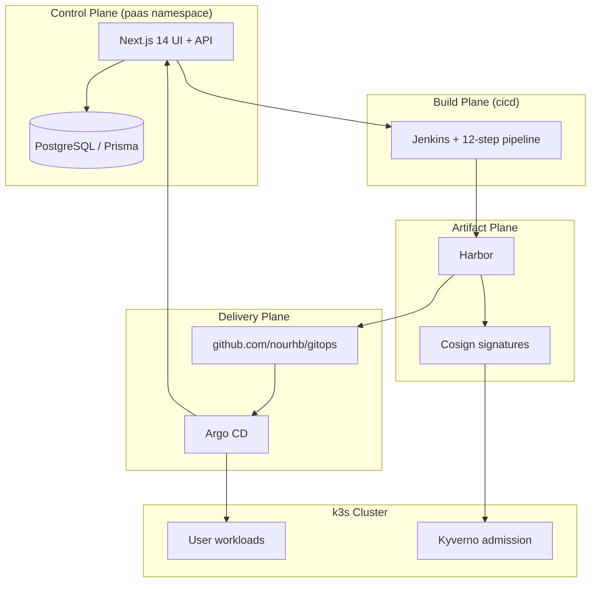
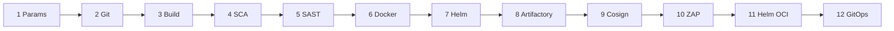
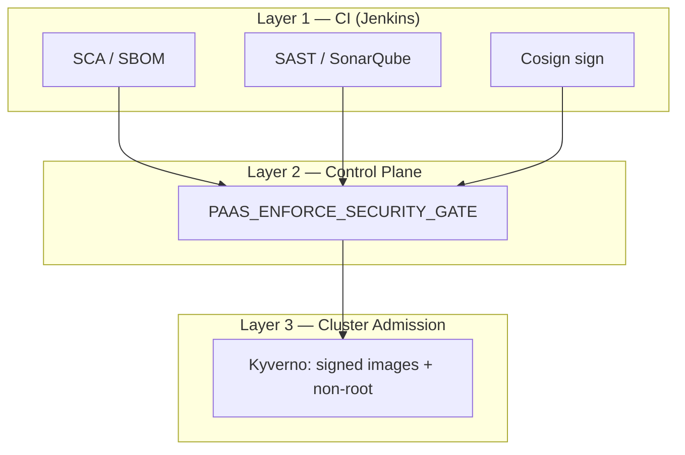
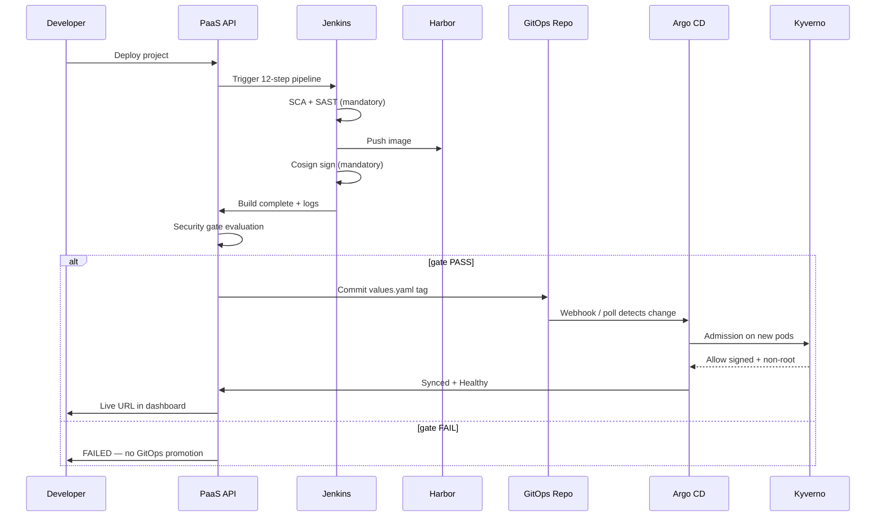

# Kubernetes-Based DevSecOps Platform as a Service
## 30-Slide PFE Defense Presentation — Full Speaker Content

**Author:** BOUAJILA Nour El Houda  
**Organization:** Digital From Scratch  
**Academic Year:** 2025–2026  
**Repositories:**
- Control plane & pipeline: [github.com/nourhb/devsecops_paas_miscroservices](https://github.com/nourhb/devsecops_paas_miscroservices)
- GitOps delivery: [github.com/nourhb/gitops](https://github.com/nourhb/gitops)

> **How to use:** Each slide block is self-contained (title + on-slide bullets + speaker script). Import into PowerPoint, Google Slides, or Marp. Diagrams use Mermaid — render in draw.io, Mermaid Live, or paste as figures from the thesis.

---

## SLIDE 1 — Title

### On slide
**Implementation of a Kubernetes-Based DevSecOps Platform as a Service**

Bachelor’s Degree in Computer Science — Cloud & Virtualisation (PFE / Final-Year Project)  
Digital From Scratch, Tunisia

Academic Supervisor: Mr. Louhichi Walid  
Professional Supervisor: Mr. Riabi Oussema

BOUAJILA Nour El Houda | 2025–2026

### Speaker notes
Open with the core claim: this is not a slide deck about tools — it is an **integrated socio-technical system** that collapses a fragmented DevSecOps toolchain into one control plane while preserving enterprise-grade enforcement at the cluster boundary.

---

## SLIDE 2 — The Problem: Fragmented Toolchains

### On slide
- Teams adopt DevOps + Kubernetes — yet **operational complexity explodes**
- Jenkins, Harbor, SonarQube, Argo CD, kubectl: **five UIs, five vocabularies**
- Junior developers debug **orchestration**, not application logic
- Security is **bolted on** — rarely observable from a single narrative

**Research gap:** abstraction without losing auditability

### Speaker notes
Anchor the motivation from the thesis General Introduction: the observed failure mode is not missing tools — it is **cognitive overload** and **opaque handoffs** between CI, registry, policy, and GitOps. The PaaS hypothesis: *one guided workflow, many enforceable gates*.

---

## SLIDE 3 — Research Objectives

### On slide
| Objective | Measurable outcome |
|-----------|-------------------|
| **O1** — Democratize DevSecOps | Git → URL without kubectl expertise |
| **O2** — Unify observability | 12 pipeline stages visible in one UI |
| **O3** — Enforce security | Mandatory SCA, SAST, Cosign + platform gate |
| **O4** — GitOps-native delivery | Declarative promotion via `values.yaml` |
| **O5** — Validate on real cluster | 3-node k3s lab, multi-profile builds |

### Speaker notes
Frame these as engineering requirements, not marketing goals. Each objective maps to concrete artifacts in `devsecops_paas_miscroservices` (control plane, Jenkinsfile, lab scripts) and `gitops` (promotion target).

---

## SLIDE 4 — Solution Vision

### On slide
**Platform as a Service** = monolithic **control plane** + distributed **execution plane**

```
Developer → PaaS UI → Jenkins → Harbor → GitOps repo → Argo CD → k3s
                ↑______________________________________________|
                         status, security, monitoring feedback
```

- **Students / small teams:** guided errors, pipeline help modals  
- **Enterprise posture:** RBAC, Keycloak (optional), Kyverno admission

### Speaker notes
Emphasize architectural honesty from the General Conclusion: this is **not** a microservices PaaS. It is a deliberate **modular monolith** (Next.js 14) orchestrating best-of-breed external systems — a pattern common in internal developer platforms (IDPs).

---

## SLIDE 5 — Design Principles

### On slide
1. **Single pane of glass** — one Next.js dashboard  
2. **Pipeline as contract** — `Jenkinsfile.paas-deploy` is the law  
3. **Git as source of truth for runtime** — GitOps promotion  
4. **Defense in depth** — Jenkins gates + platform gate + Kyverno  
5. **Profile-driven builds** — language detection, not manual YAML  
6. **Operability first** — `lab.sh` for reproducible recovery  

### Speaker notes
These principles explain every major design trade-off: why Jenkins stayed primary over Tekton in production lab, why Cosign is mandatory, why Argo CD watches a **separate** GitOps repository.

---

## SLIDE 6 — Global Architecture

### On slide


### Speaker notes
Walk the audience through **planes**, not pods. The control plane never builds images itself — it **orchestrates** and **verifies**. This separation is what allows the same UI to target lab (NodePort) or hosted production (ingress + GitHub Actions).

---

## SLIDE 7 — Control Plane Architecture

### On slide
**Next.js 14** layered architecture (`paas/frontend/src/`):

| Layer | Responsibility |
|-------|----------------|
| **Presentation** | `(dashboard)/` projects, pipeline, security, monitoring |
| **API** | `app/api/` REST — auth, deploy, Jenkins, K8s, webhooks |
| **Domain** | `server/` — BuildPlanner, GitOps, security gate, reconcile |
| **Data** | Prisma ORM → PostgreSQL |
| **Integration** | HTTP clients: Jenkins, Harbor, Argo CD, Sonar, DT, Prometheus |

Stack: React 18, TypeScript 5.6, TanStack Query, Zod validation

### Speaker notes
Highlight `cluster-deploy-service`, `gitops-github-service`, `build-planner.ts` as the **semantic core**. The UI is not a Jenkins wrapper — it owns deployment state, security gate logic, and GitOps commits.

---

## SLIDE 8 — Data Model & Persistence

### On slide
PostgreSQL 16 (`postgres.paas.svc`) stores:
- **Users** — auth sessions, roles  
- **Projects** — Git URL, branch, namespace, build profile  
- **Deployments** — build ID, image tag, URL, gate status  
- **Container images** — Harbor references, digest metadata  

Schema evolution: `prisma db push` via CI Job (`prisma-migrate-job.yaml`)

Init container pattern: frontend waits for `postgres:5432` before serving traffic

### Speaker notes
Connect to operational reality: PVC on worker2, `lab.sh db-repair` for TCP/schema recovery. Data durability is what makes the platform a **system of record**, not a CI viewer.

---

## SLIDE 9 — Dual-Repository Model

### On slide
| Repository | Role | Key paths |
|------------|------|-----------|
| **devsecops_paas_miscroservices** | Control plane, pipeline, manifests, lab ops | `paas/frontend/`, `paas/jenkins/`, `paas/k8s-manifests/`, `paas/scripts/lab.sh` |
| **gitops** | Runtime desired state per app | `apps/{projectName}/values.yaml`, Helm releases |

Promotion flow:
```
Jenkins build #N → platform gate → commit image.tag → Argo CD sync
```

Bootstrap chart template: `paas/gitops/apps/simple-app/` → copied to `gitops` on first deploy

### Speaker notes
This is classic **GitOps separation of concerns**: application code repo ≠ deployment intent repo. Auditors can diff `values.yaml` without reading Jenkins logs.

---

## SLIDE 10 — Laboratory Infrastructure

### On slide
**VMware** host-only network — **192.168.56.129**

| Node | Role | Notes |
|------|------|-------|
| master | control-plane | PaaS frontend pinned (local images) |
| worker1 | worker | SchedulingDisabled (storm prevention) |
| worker2 | worker | Postgres PVC affinity |

**k3s** v1.35.4+k3s1 — lightweight Kubernetes, Traefik ingress  
No Terraform/AWS — manifests + `lab.sh` for reproducibility

### Speaker notes
Position the lab as a **validation harness**, not production. Three nodes exercise scheduling, PVC placement, and ingress — enough to surface real failures (disk pressure, Kyverno webhooks, Harbor 502).

---

## SLIDE 11 — Platform Services & NodePorts

### On slide
| Service | NodePort | Namespace |
|---------|----------|-----------|
| PaaS UI | **30100** | paas |
| Jenkins | **30090** | cicd |
| Harbor | **30002** | harbor |
| SonarQube | **30900** | sonarqube |
| Dependency-Track API | **30353** | dependency-track |
| Traefik (user apps) | **30659** | ingress |

User app URL pattern: `http://{app}.192.168.56.129.nip.io:30659/`

### Speaker notes
NodePorts are a **lab ergonomics** choice — browser-accessible without DNS. Production path uses `paas-hosting.yml` GitHub Actions + cluster secrets instead of `lab.sh`.

---

## SLIDE 12 — End-to-End Workflow (6 Phases)

### On slide
1. **Project registration** — Git URL, branch, namespace; language auto-detection  
2. **Deploy trigger** — UI button or GitHub webhook (`GITHUB_WEBHOOK_BUILD_MODE`)  
3. **Build orchestration** — `BuildPlanner` → Jenkins; Jenkinsfile synced before run  
4. **Security & image build** — 12 stages including SCA, SAST, Docker, Cosign  
5. **Platform security gate** — signature, Sonar, DT, policy before promotion  
6. **GitOps promotion** — `values.yaml` commit → Argo CD → HTTP reachability check  

### Speaker notes
This is Figure 5.2 / Chapter 5 workflow. Stress **feedback loops**: every phase writes state back to PostgreSQL and the dashboard.

---

## SLIDE 13 — BuildPlanner & Language Detection

### On slide
`build-planner.ts` + `repository-language.ts`:
- Inspect repo root: `package.json`, `pom.xml`, `build.gradle`, `requirements.txt`, `Dockerfile`
- Select **build profile** + Jenkins parameters
- Generate Dockerfile when absent (profile-specific templates)

**Validated profiles:** `node` | `static` | `python` | `java` | `custom`

Optional backend: `BUILD_BACKEND=tekton` → Kubernetes-native `PipelineRun` (experimental)

### Speaker notes
BuildPlanner is the **compiler front-end** of the PaaS. Extending a new language = new template + detection heuristic — the user workflow unchanged.

---

## SLIDE 14 — Build Profiles in Depth

### On slide
| Profile | Stacks detected | Build | Deploy |
|---------|-----------------|-------|--------|
| **node** | Next.js, NestJS, Express | npm ci / build | Node server image |
| **static** | React, Vue, Angular, Vite | npm build | nginx static |
| **python** | Django, FastAPI, Flask | pip / requirements | WSGI/ASGI image |
| **java** | Maven, Gradle | mvn / gradle in Jenkins | Docker (Maven Dockerfile auto) |
| **custom** | User Dockerfile | docker build | as-is |

**Known limit:** auto-generated Java Dockerfile targets Maven — Gradle-only needs `custom`

### Speaker notes
Cite validated projects from thesis Chapter 8: angular-docker, simple-java-docker, tutorial-react-docker, etc.

---

## SLIDE 15 — Jenkins as Primary Build Backend

### On slide
- **Jenkins** in `cicd` namespace — NodePort 30090  
- Pipeline: `paas/jenkins/Jenkinsfile.paas-deploy` (+ CPS split: `Jenkinsfile.paas-deploy-stages.groovy`)  
- Pre-sync: `JENKINS_SYNC_INLINE_JOB_BEFORE_TRIGGER=true`  
- Agent tools: Helm 3.16.3, Crane 0.20.6 (`lab-jenkins-agent-tools.sh`)  
- Scanner images: OWASP DC, CycloneDX cdxgen, ZAP stable  

**Why Jenkins over Tekton (lab):** mature Groovy pipeline, rich plugin ecosystem, CPS split for `MethodTooLarge`

### Speaker notes
Acknowledge Tekton as strategic alternative — `build-backend-tekton.ts` exists — but lab validation path is Jenkins-first for reproducibility.

---

## SLIDE 16 — The Twelve-Step Pipeline (Overview)

### On slide


**Mandatory (hard fail):** Steps 4, 5, 9 + platform gate  
**Required (deploy path):** Steps 1–3, 6, 12  
**Optional (non-fatal):** 7, 8, 10, 11

### Speaker notes
Table 5.1 from thesis. Emphasize **graduated enforcement** — not everything blocks, but security-critical paths do.

---

## SLIDE 17 — Pipeline Steps 1–6: Build & Analyze

### On slide
| Step | Name | Tools | Enforcement |
|------|------|-------|-------------|
| 1 | Params validation | Groovy guards | Required |
| 2 | Git checkout | Git | Required |
| 3 | Application build | Maven, npm, pip | Required |
| 4 | **SCA** | Dependency-Check, CycloneDX, Dependency-Track | **Mandatory** |
| 5 | **SAST** | SonarQube scanner | **Mandatory** |
| 6 | Docker image | Docker, crane → Harbor | Required |

Step 4 produces **SBOM** uploaded to Dependency-Track — supply-chain traceability

### Speaker notes
Walk through Step 4–5 as the **shift-left core**. Show thesis Figure 8.4 (SCA console) and 8.5 (Sonar gate) if presenting live.

---

## SLIDE 18 — Pipeline Steps 7–12: Package, Sign, Deliver

### On slide
| Step | Name | Tools | Enforcement |
|------|------|-------|-------------|
| 7 | Helm packaging | helm package | Non-fatal |
| 8 | Artifactory upload | JFrog | Non-fatal |
| 9 | **Cosign signing** | Cosign v2.4.0 | **Mandatory** |
| 10 | DAST baseline | OWASP ZAP | Non-fatal |
| 11 | Helm OCI push | Harbor OCI | Non-fatal |
| 12 | Archive + GitOps handoff | Jenkins → PaaS API | Required |

Step 12 does **not** commit to Git directly — PaaS platform gate runs first, then `gitops-github-service` commits

### Speaker notes
Cosign signing (Figure 8.6) creates the trust anchor Kyverno verifies at admission. Step 12 is the **handoff boundary** from CI to control plane.

---

## SLIDE 19 — Defense-in-Depth Security Model

### On slide


### Speaker notes
This three-layer model is the core technical contribution: **prevent** (scan), **authorize promotion** (gate), **enforce at runtime** (admission). No single layer is sufficient.

---

## SLIDE 20 — Platform Security Gate

### On slide
After Jenkins — before GitOps commit (`PAAS_ENFORCE_SECURITY_GATE=true`):

| Check | Action if fail |
|-------|----------------|
| Image exists + **Cosign signature** valid | Block promotion |
| **SonarQube** status PASSED | Block promotion |
| **Dependency-Track** linked to SBOM | Block promotion |
| Policy evaluation (Kyverno default) | Block promotion |
| Trivy findings | Warn / visibility |
| OPA/Gatekeeper | Only if `POLICY_ENGINE` configured |

Fail → deployment marked FAILED, **no** `values.yaml` update

### Speaker notes
This gate is what makes the PaaS more than a Jenkins trigger UI — it is a **policy decision point** with database audit trail.

---

## SLIDE 21 — GitOps Repository Structure

### On slide
**Repository:** [github.com/nourhb/gitops](https://github.com/nourhb/gitops)

```
gitops/
└── apps/
    └── {projectName}/
        ├── Chart.yaml          # Helm chart metadata
        ├── values.yaml         # image.tag ← promotion target
        └── templates/          # from simple-app bootstrap
```

Example `values.yaml`:
```yaml
image:
  repository: 192.168.56.129:30002/paas/simple-app
  tag: "99"
ingress:
  hosts:
    - host: simple-app.192.168.56.129.nip.io
```

### Speaker notes
Every deploy is a **Git commit** — reproducible, reviewable, rollback-friendly. Argo CD diff shows exactly what changed.

---

## SLIDE 22 — Helm Chart: `simple-app`

### On slide
Bootstrap chart: `paas/gitops/apps/simple-app/`

Templates:
- `deployment.yaml` — rolling update, resource limits, non-root  
- `deployment-bluegreen.yaml` — blue/green strategy option  
- `service.yaml` — ClusterIP  
- `ingress.yaml` — Traefik class, nip.io hosts  

Features:
- `imagePullSecrets: harbor-regcred`  
- Configurable `nodeSelector` (lab: master pin)  
- Values-driven env injection  

### Speaker notes
Chart is intentionally **minimal** — suitable for student apps, not a full production chart. Complexity lives in the pipeline + gate, not in 200-line Helm values.

---

## SLIDE 23 — Argo CD & Runtime Synchronization

### On slide
1. Platform commits new `image.tag` to `gitops`  
2. Argo CD Application watches repo path `apps/{project}`  
3. Sync → Deployment rollout on target namespace  
4. Platform polls: Synced + Healthy  
5. HTTP probe on Ingress URL → store final URL in DB  

Dashboard shows: sync status, health, live URL (`http://{project}.192.168.56.129.nip.io:30659/`)

### Speaker notes
Reference thesis Figure 8.8. Argo CD is the **continuous reconciliation engine** — the PaaS does not `kubectl apply` user apps directly in the happy path.

---

## SLIDE 24 — Kyverno Cluster Policies

### On slide
Manifests: `paas/k8s-manifests/kyverno/`

| Policy | Effect |
|--------|--------|
| `require-signed-images.yaml` | Reject unsigned container images |
| `require-non-root.yaml` | Enforce non-root `securityContext` |

Cosign public key synced to cluster (`lab-kyverno.sh bootstrap`)  
Lab fail-open: `lab-kyverno-webhook-guard.sh` when admission pod is down

**Result:** even a bypassed CI cannot run arbitrary unsigned images

### Speaker notes
Kyverno is the **runtime trust anchor**. Connect to NIST SSDF / SLSA thinking — provenance and policy at deploy time.

---

## SLIDE 25 — Observability & Integrations

### On slide
| Tool | Role in PaaS |
|------|----------------|
| **Prometheus** | Metrics — in-cluster for frontend pod (`kube-prometheus-stack`) |
| **Grafana** | Operator dashboards (optional) |
| **SonarQube** | SAST history — Security tab |
| **Dependency-Track** | SBOM / CVE — Security tab |
| **Harbor** | Image registry + Trivy scan |
| **Keycloak** | Optional SSO |
| **Artifactory / ZAP** | Optional pipeline stages |

UI: Monitoring page, Cluster explorer, Integrations health probes

### Speaker notes
`platform-integration-health.ts` aggregates reachability — the platform **knows** if Sonar token is stale before user triggers deploy.

---

## SLIDE 26 — User Experience: Guided DevSecOps

### On slide
Dashboard surfaces:
- **Pipeline view** — 12 stages with status + help modals  
- **Security tab** — Sonar, DT, Cosign, policy summary  
- **Deployments** — build logs, gate outcome, live URL  
- **Cluster explorer** — pods, namespaces (no mandatory kubectl)  

Error philosophy: plain language in the UI — e.g. *"Database is still starting"* with wait/retry guidance  
Pipeline help modals explain SCA, SAST, Cosign for beginners (no kubectl jargon)

**Note:** `lab.sh` is **operator tooling** for the VMware lab VM only — end users never run shell commands

### Speaker notes
UX is a **first-class architectural component**. Reducing mean-time-to-understand (MTTU) is as important as reducing mean-time-to-deploy.

---

## SLIDE 27 — Validation & Demonstrated Results

### On slide
**Proven end-to-end:**
- Register Git project → Jenkins #N → Harbor image → GitOps commit → Argo sync → live URL  
- **Five profiles** exercised on lab cluster  
- Security gate blocks unsigned / failed Sonar promotions  
- Kyverno rejects unsigned images at admission  

Evidence: thesis Chapter 8 screenshots — Jenkins stages, SCA, SAST, Cosign, GitOps diff, Argo healthy

Self-deploy: `paas-hosting.yml` — platform deploys itself via GitHub Actions

### Speaker notes
Be precise: validated on **k3s lab**, not multi-region production. Results are **engineering proof**, not formal user-study statistics — honest scope for PFE jury Q&A.

---

## SLIDE 28 — Operational Engineering (`lab.sh`)

### On slide
`paas/scripts/lab.sh` — single operator entry point:

| Command | Purpose |
|---------|---------|
| `boot-enable` | One-shot: install VM auto-start on power-on |
| `start` / `emergency-up` | Recover after VM reboot |
| `harden` | Frontend safety + watchdog cron |
| `db-repair` | Postgres TCP + schema |
| `sonar-bootstrap` | CLI token + admin password |
| `pipeline-heal` | Full 12-step toolchain sync |
| `frontend-force` | Recovery image on master |

Lesson: **platforms need runbooks** — IDPs fail without operability

### Speaker notes
Chapter 6 + 8 limitations: disk pressure, pod storms, Jenkins CPS limits — all addressed with documented recovery. This is mature engineering honesty.

---

## SLIDE 29 — Limitations & Future Work

### On slide
**Current limitations:**
- Monolithic control plane — vertical scaling bound  
- Jenkins CPS / `MethodTooLarge` — mitigated via stages split  
- Lab cluster — not HA production  
- Java Gradle auto-Dockerfile gap  
- VM boot auto-start depends on systemd + disk headroom (`boot-enable`); lab-only, not hosted production

**Future work:**
- Additional language profiles (Go, .NET, PHP)  
- Tekton as default on large clusters  
- Keycloak SSO production hardening  
- Multi-tenant RBAC + quota enforcement  
- SLSA Level 3 provenance metadata  

### Speaker notes
Invite questions on trade-offs. The path to production is **operational hardening**, not feature accumulation.

---

## SLIDE 30 — Conclusion & References

### On slide
**We built a Kubernetes-based DevSecOps PaaS that:**
- Unifies CI/CD, security, and GitOps behind one Next.js control plane  
- Enforces **mandatory** SCA, SAST, and Cosign + **platform gate** + **Kyverno**  
- Delivers apps via **Harbor → gitops repo → Argo CD**  
- Serves both beginners (guided UI) and operators (strict gates)

**Code:**
- [github.com/nourhb/devsecops_paas_miscroservices](https://github.com/nourhb/devsecops_paas_miscroservices)
- [github.com/nourhb/gitops](https://github.com/nourhb/gitops)

**Thank you — Questions?**

### Speaker notes
Close with the thesis General Conclusion line: *connect cloud infrastructure, DevSecOps automation, application security, GitOps delivery, and user-oriented design in one real implementation.* Offer live demo: login → project → pipeline view → Argo CD → nip.io URL.

---

## APPENDIX D — Recommended Additions (swap in if jury expects PFE structure)

### Optional slide — Host organization & project context
- **Digital From Scratch** (Tunisia) — digital agency; first **cloud-native DevSecOps** initiative  
- **Problem:** one developer, no dedicated DevOps team, many disconnected tools  
- **PFE goal:** any developer can push Git → get URL + understand security results  

### Optional slide — Contributions (thesis §3.3)
1. Guided deployment with plain-language errors  
2. Unified DevSecOps visibility (pipeline + security + cluster in one UI)  
3. Five validated build profiles via BuildPlanner  
4. Enterprise-ready hooks: RBAC, optional Keycloak, security gate, Cosign + Kyverno  
5. GitOps promotion via `apps/{project}/values.yaml`  

### Optional slide — Methodology (Agile / Sprints)
| Sprint | Focus |
|--------|--------|
| Sprint 1 | DevSecOps study, tool comparison, k3s lab design |
| Sprint 2 | Cluster bootstrap, Jenkins, Harbor, Sonar, Argo CD, Kyverno |
| Sprint 3 | Next.js control plane — auth, projects, pipeline UI, security tab |

### Optional slide — Lab vs hosted production
| | **VM lab** | **Hosted production** |
|---|------------|------------------------|
| Operator | `lab.sh` scripts | GitHub Actions `paas-hosting.yml` |
| Access | NodePorts (30100, …) | Ingress + registry secrets |
| User deploys | UI only | UI only |
| Schema | `postgres schema` / Job | `prisma-migrate-job.yaml` in CI |

### Optional slide — Authentication & RBAC
- Email/password + JWT sessions; optional **Keycloak** SSO  
- Roles: **ADMIN** (all projects) / **DEVELOPER** (own projects)  
- Register, verify-email, password-reset flows in `(auth)/` routes  

## APPENDIX E — Review checklist before defense

- [ ] Replace Mermaid diagrams with thesis figures (Figs 2.2, 5.1, 5.2, 8.4–8.8)  
- [ ] Embed **real screenshots** on slides 16–18, 21, 23, 27  
- [ ] Add **agenda** slide after title  
- [ ] Do **not** call this doctoral — it is a **Bachelor’s PFE**  
- [ ] Clarify Kyverno **fail-open** is lab recovery only; policies are **Enforce** in manifests  
- [ ] Mention Java: Jenkins builds **Gradle**, but auto-Dockerfile is **Maven-only** → `custom` profile  

---

## APPENDIX A — Suggested Demo Script (5 min)

1. Open `http://192.168.56.129:30100/login`  
2. Show project list + pipeline 12 stages  
3. Open Jenkins build console at Step 4 (SCA) and Step 9 (Cosign)  
4. Show `gitops` repo `values.yaml` diff with new tag  
5. Show Argo CD application Synced/Healthy  
6. Open `http://{app}.192.168.56.129.nip.io:30659/`  

## APPENDIX B — Key Thesis Figures to Embed

| Slide | Figure |
|-------|--------|
| 6 | Fig 2.2 Global architecture |
| 12 | Fig 5.2 Pipeline flow |
| 16 | Fig 5.1 Twelve-step overview |
| 21 | Fig 5.4 GitOps model |
| 27 | Figs 8.4–8.8 validation screenshots |

## APPENDIX C — Mermaid: Security Gate Sequence


