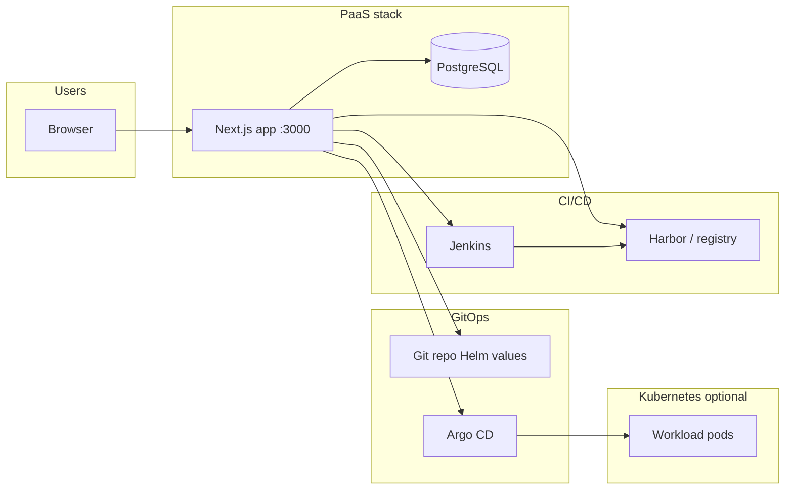

# DevSecOps PaaS — Project guide for presenters

This document explains what the repository contains, how the pieces connect, and how someone operates the system from the UI through to the cluster.

---

## 1. What this product is

**A self-hosted “control plane” web application** that lets development teams:

- Register **projects** (Git repo, branch, language, namespace).
- **Trigger builds** on **Jenkins** (or optionally **Tekton**).
- **Deploy** applications through **Harbor** (images), **Helm/GitOps** (values in Git), and **Argo CD** (sync to Kubernetes).
- See **security posture** (Dependency-Track, Trivy, Sonar-style quality gate, Cosign/OPA signals when configured).
- See **runtime signals** (Prometheus-backed CPU/memory, Kubernetes pod summaries when enabled, Grafana link).

There is **no separate Java microservice** in this path: the **Next.js app** in `paas/frontend` is the **full stack** (React UI, REST API routes under `src/app/api`, server-only integration code under `src/server`). Data is stored in **PostgreSQL** via **Prisma**.

---

## 2. Who uses it

| Role | Typical use |
|------|-------------|
| **Developer** | Own projects only: build, deploy, view logs, security/monitoring for those projects. |
| **Admin** | Same platform, broader access to operations and integrations as implemented in routes/guards. |

Authentication is **JWT + HTTP-only cookie**; email verification and password reset flows exist when SMTP is configured.

---

## 3. High-level architecture

**Typical deploy path (conceptual):**

1. User triggers **deploy** in the UI.
2. App creates a **Deployment** row, calls **Jenkins** with parameters (Git URL, branch, project id, registry hints, etc.).
3. Jenkins runs **`Jenkinsfile.paas-deploy`**: checkout, build/test, SCA/SAST stages, image build/push, optional signing, then hands off to PaaS logic for **Helm values commit** and **Argo sync** when configured.
4. On success, the app updates **project** fields (e.g. image tag, URLs, logs) and marks the deployment **deployed** or **failed** with reasons.

---

## 4. Repository layout (what lives where)

| Path | Purpose |
|------|---------|
| `paas/frontend/` | Next.js 14 app: UI, API routes, Prisma schema, Docker build for the control plane. |
| `paas/jenkins/` | `Jenkinsfile.paas-deploy` (main pipeline), optional Groovy variants, Swarm compose example. |
| `paas/docker-compose.yml` | Local stack: Postgres, one-off Prisma migrate (`db-push`), `paas-frontend` with monorepo mount for Jenkinsfile sync. |
| `paas/docker/` | Dockerfiles used by compose (frontend image, db-push). |
| `paas/scripts/` | Operational Python/helpers (Harbor, Argo, SSH helpers) — not required for core UI dev. |
| `paas/terraform/`, `paas/k8s-manifests/`, `paas/gitops/` | Infra/manifest examples; adapt to your environment. |
| `paas/test-app/` | Sample app (submodule in some clones) for demos. |

---

## 5. Main user-facing areas (routes)

All under the dashboard after login (paths are illustrative; `uuid` is the project id):

| Area | Route pattern | Purpose |
|------|---------------|---------|
| Dashboard | `/dashboard` | Overview metrics and rollups. |
| Projects | `/projects`, `/projects/[id]` | Project CRUD, build/deploy actions, status. |
| Pipeline | `/pipeline/[id]` | Delivery path vs Jenkins log markers, build/deploy consoles. |
| Docker | `/docker/[id]` | Image/history oriented view. |
| Security | `/security/[id]` | Aggregated security metrics (when backends available or graceful fallbacks). |
| Monitoring | `/monitoring/[id]` | CPU/memory + pod status summary + Grafana link. |
| Cluster | `/cluster` | Cluster/workspace view, logs, recent deployments (K8s or DB-backed). |
| Deployments | `/deployments/[id]` | Single deployment poll page and logs. |
| Integrations | `/integrations` | Platform tool reachability/config overview. |
| Artifacts | `/artifacts` | Artifact listing UX as implemented. |

**API** lives under `/api/...` (same origin): projects, builds, deployments, auth, optional k8s proxy routes, Jenkins helpers, etc.

---

## 6. Data model (Prisma — simplified)

Core entities:

- **User** — identity, role, auth tokens relations.
- **Project** — name, Git URL, branch, namespace, `buildStatus`, `lastDeploymentStatus`, `podStatus`, log buffers, `imageTag`, optional `url`, soft-delete.
- **Deployment** — links to project, Jenkins/Tekton metadata, status, logs, failure reason/message.
- **ContainerImage** — promoted image records for audit.

The UI **polls** status endpoints and invalidates React Query caches after mutations.

---

## 7. Build backend

Controlled by **`BUILD_BACKEND`**: **`jenkins`** (default) or **`tekton`**.

- **Jenkins**: HTTP API with crumb, parameterized job names (`JENKINS_BUILD_JOB_NAME` / `JENKINS_DEPLOY_JOB_NAME` often shared as `paas-deploy`). Optional **inline sync** pushes `Jenkinsfile.paas-deploy` XML into Jenkins before trigger when `JENKINS_SYNC_INLINE_JOB_BEFORE_TRIGGER=true` and monorepo root is mounted.
- **Tekton**: Kubernetes API polling of `PipelineRun` resources (when configured).

---

## 8. Jenkins pipeline (conceptual stages)

The main file is **`paas/jenkins/Jenkinsfile.paas-deploy`**. In order of execution you will see stages such as:

1. **Parameter / validation** — Git, branch, image name, credentials.
2. **Checkout** — clone `GIT_URL` / `BRANCH`.
3. **Application build** — Maven, npm/Next, or Python depending on repo manifests.
4. **SCA / SAST** — Dependency-Track/SBOM path, Sonar when env provides URLs/tokens (often non-fatal).
5. **Docker image** — build or “dockerless” paths depending on agent capabilities.
6. **Helm chart packaging** — artifact under workspace for GitOps.
7. **Registry push** — Harbor or crane-style push depending on setup.
8. **Optional Cosign / ZAP / Helm OCI push** — gated by parameters and tools on the agent.

The **control plane** stores **tail of console logs** on deployments/projects for the UI; for long steps the pipeline uses **keepalive** patterns to avoid Jenkins durable-task timeouts on quiet output.

---

## 9. Post-build: GitOps and Argo CD

When Git and tokens are configured (`GITOPS_*`), the server can **commit Helm value updates** (image tag bump) to a repository. **Argo CD** (`ARGOCD_*`) can then **sync** the application. Failures are recorded on the deployment with reasons such as GitOps or Argo errors.

---

## 10. Security and policy features in the app

The security page aggregates:

- **SonarQube** quality gate (HTTP API) when `SONAR_BASE_URL` + token exist.
- **Dependency-Track** project metrics/findings when URL + API key exist.
- **Trivy** counts when a Trivy server URL is set.
- **Cosign** verify when a public key is present; policy text explains unsigned images.
- **OPA** HTTP eval when `OPA_EVAL_URL` is set; skipped when not configured.
- **Kyverno** policy listing when Kubernetes client is available and policy engine is Kyverno.

If an integration is missing or unreachable, the API is designed to **degrade gracefully** (zeros / unknown / short message) instead of failing the whole page.

---

## 11. Kubernetes integration

When **`KUBERNETES_ENABLED=true`** and kubeconfig is available to the process:

- **Cluster** pages can list pods/services/deployments (subject to RBAC).
- **Pod logs** can be fetched for namespaces tied to projects.
- **Project status** enriches `podStatus` with live counts.

When Kubernetes is off, pod status is derived from **deployment state** and short hints instead of staying stuck on “UNKNOWN”.

---

## 12. Running the stack locally (typical)

From **`paas/`** (not `paas/frontend/` alone, so compose resolution and env files behave as designed):

1. Copy `paas/frontend/docker-compose.env.example` → `paas/frontend/docker-compose.env` and fill **Jenkins**, DB override if needed, **Harbor**/**Argo** as in your lab.
2. Optionally add `paas/.env` for secrets (compose merges it after `docker-compose.env`; duplicate keys: last wins).
3. `docker compose up --build`  
   - Postgres on host **5433** → **5432** in container.  
   - `db-push` applies Prisma schema.  
   - **Frontend** on **3000** with monorepo mount at `/monorepo` for Jenkinsfile sync.

**Jenkins URL from inside the frontend container** must be reachable (often the VM LAN IP or `host.docker.internal` depending on Docker setup).

---

## 13. Configuration cheat sheet (grouped)

| Group | Variables (examples) |
|--------|----------------------|
| Core | `DATABASE_URL`, `JWT_SECRET`, `APP_BASE_URL`, SMTP for mail |
| Jenkins | `JENKINS_BASE_URL`, `JENKINS_USERNAME`, `JENKINS_API_TOKEN`, job name overrides, `PAAS_MONOREPO_ROOT`, sync flag |
| Registry / Helm OCI | `HARBOR_*`, `HELM_OCI_*` |
| GitOps | `GITOPS_REPO_URL`, `GITOPS_REPO_TOKEN`, path pattern |
| Argo | `ARGOCD_BASE_URL`, `ARGOCD_AUTH_TOKEN`, `ARGOCD_APP_PREFIX` |
| Security tools | `SONAR_*`, `DEPENDENCY_TRACK_*`, `TRIVY_*`, `COSIGN_*`, `OPA_*`, `POLICY_ENGINE` |
| Kubernetes | `KUBERNETES_ENABLED`, `KUBE_CONFIG_PATH`, TLS skip flags |
| Build backends | `BUILD_BACKEND`, Tekton variables if used |

Authoritative defaults and parsing: `paas/frontend/src/server/config/env.ts`.

---

## 14. Presenter checklist (demo flow)

1. Show **login** and **projects list**.
2. Open a **project**: Git URL, branch, namespace, current build/deploy status.
3. Trigger **build** (or show **pipeline** page with delivery path vs logs).
4. Open **deployment** row or **Cluster** recent deployments — show log buffer and optional Jenkins fetch.
5. Show **Security** (even partial data explains the integration story).
6. Show **Monitoring** + **Grafana** link.
7. Mention **integrations hub** for “what is configured vs reachable”.

---

## 15. Honest limitations to mention

- Full value assumes a working **Jenkins** job aligned with this repo’s **Jenkinsfile** and reachable **Harbor/Git/Argo** in your environment.
- **Tekton** path requires operational Tekton CRDs and RBAC.
- **Cosign/OPA** enforcement in the security **score** is only as accurate as your keys and endpoints; without them, the UI explains gaps rather than blocking the page.

---

*Last updated to match repository layout and behavior at documentation time; verify against `env.ts` and live Jenkinsfile for your deployment as the system evolves.*
