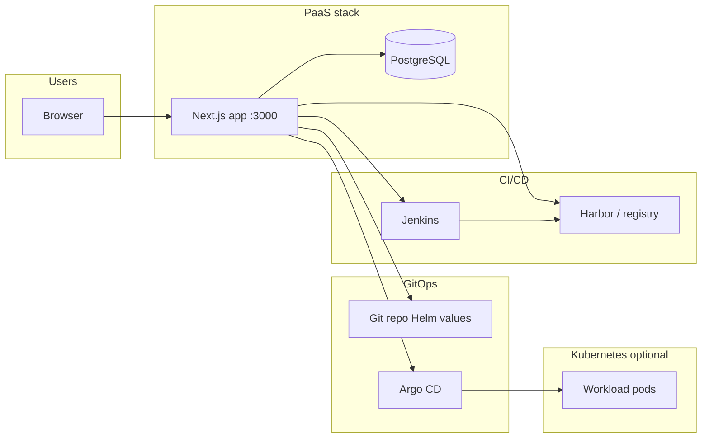
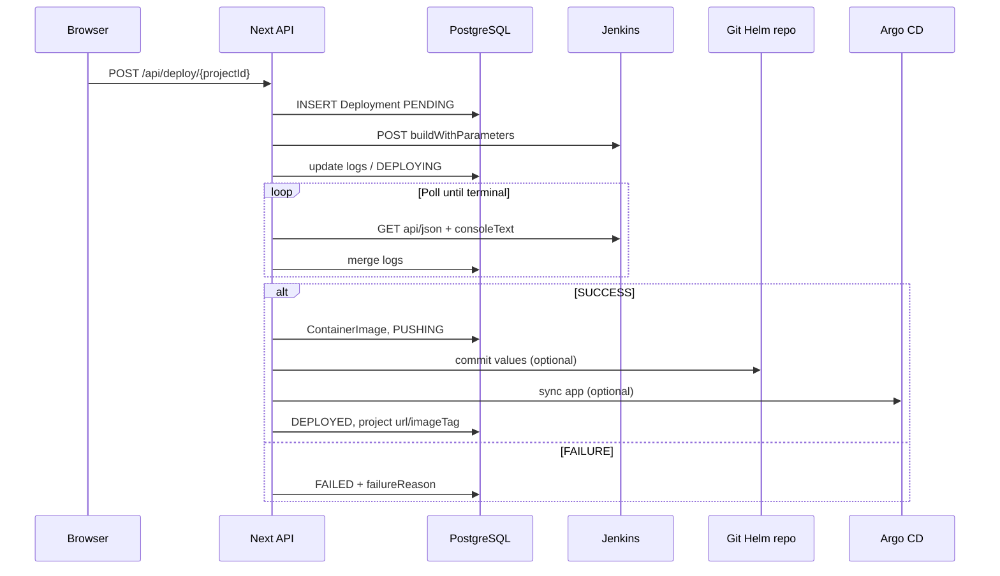

# DevSecOps PaaS — Project guide for presenters

This document explains what the repository contains, how the pieces connect, and how someone operates the system from the UI through to the cluster.

---

## 1. What this product is

**A self-hosted “control plane” web application** that lets development teams:

- Register **projects** (Git repo, branch, language, namespace).
- **Trigger builds** on **Jenkins** (or optionally **Tekton**).
- **Deploy** applications through **Harbor** (images), **Helm/GitOps** (values in Git), and **Argo CD** (sync to Kubernetes).
- See **security posture** (Dependency-Track, Trivy, Sonar-style quality gate, Cosign/OPA signals when configured).
- See **runtime signals** (Prometheus-backed CPU/memory, Kubernetes pod summaries when enabled, Grafana link).

There is **no separate Java microservice** in this path: the **Next.js app** in `paas/frontend` is the **full stack** (React UI, REST API routes under `src/app/api`, server-only integration code under `src/server`). Data is stored in **PostgreSQL** via **Prisma**.

---

## 2. Who uses it

| Role | Typical use |
|------|-------------|
| **Developer** | Own projects only: build, deploy, view logs, security/monitoring for those projects. |
| **Admin** | Same platform, broader access to operations and integrations as implemented in routes/guards. |

Authentication is **JWT + HTTP-only cookie**; email verification and password reset flows exist when SMTP is configured.

---

## 3. High-level architecture

**Typical deploy path (conceptual):**

1. User triggers **deploy** in the UI.
2. App creates a **Deployment** row, calls **Jenkins** with parameters (Git URL, branch, project id, registry hints, etc.).
3. Jenkins runs **`Jenkinsfile.paas-deploy`**: checkout, build/test, SCA/SAST stages, image build/push, optional signing, then hands off to PaaS logic for **Helm values commit** and **Argo sync** when configured.
4. On success, the app updates **project** fields (e.g. image tag, URLs, logs) and marks the deployment **deployed** or **failed** with reasons.

---

## 4. Repository layout (what lives where)

| Path | Purpose |
|------|---------|
| `paas/frontend/` | Next.js 14 app: UI, API routes, Prisma schema, Docker build for the control plane. |
| `paas/jenkins/` | `Jenkinsfile.paas-deploy` (main pipeline), optional Groovy variants, Swarm compose example. |
| `paas/docker-compose.yml` | Local stack: Postgres, one-off Prisma migrate (`db-push`), `paas-frontend` with monorepo mount for Jenkinsfile sync. |
| `paas/docker/` | Dockerfiles used by compose (frontend image, db-push). |
| `paas/scripts/` | Operational Python/helpers (Harbor, Argo, SSH helpers) — not required for core UI dev. |
| `paas/terraform/`, `paas/k8s-manifests/`, `paas/gitops/` | Infra/manifest examples; adapt to your environment. |
| `paas/test-app/` | Sample app (submodule in some clones) for demos. |

---

## 5. Main user-facing areas (routes)

All under the dashboard after login (paths are illustrative; `uuid` is the project id):

| Area | Route pattern | Purpose |
|------|---------------|---------|
| Dashboard | `/dashboard` | Overview metrics and rollups. |
| Projects | `/projects`, `/projects/[id]` | Project CRUD, build/deploy actions, status. |
| Pipeline | `/pipeline/[id]` | Delivery path vs Jenkins log markers, build/deploy consoles. |
| Docker | `/docker/[id]` | Image/history oriented view. |
| Security | `/security/[id]` | Aggregated security metrics (when backends available or graceful fallbacks). |
| Monitoring | `/monitoring/[id]` | CPU/memory + pod status summary + Grafana link. |
| Cluster | `/cluster` | Cluster/workspace view, logs, recent deployments (K8s or DB-backed). |
| Deployments | `/deployments/[id]` | Single deployment poll page and logs. |
| Integrations | `/integrations` | Platform tool reachability/config overview. |
| Artifacts | `/artifacts` | Artifact listing UX as implemented. |

**API** lives under `/api/...` (same origin): projects, builds, deployments, auth, optional k8s proxy routes, Jenkins helpers, etc.

---

## 6. Data model (Prisma — simplified)

Core entities:

- **User** — identity, role, auth tokens relations.
- **Project** — name, Git URL, branch, namespace, `buildStatus`, `lastDeploymentStatus`, `podStatus`, log buffers, `imageTag`, optional `url`, soft-delete.
- **Deployment** — links to project, Jenkins/Tekton metadata, status, logs, failure reason/message.
- **ContainerImage** — promoted image records for audit.

The UI **polls** status endpoints and invalidates React Query caches after mutations.

---

## 7. Build backend

Controlled by **`BUILD_BACKEND`**: **`jenkins`** (default) or **`tekton`**.

- **Jenkins**: HTTP API with crumb, parameterized job names (`JENKINS_BUILD_JOB_NAME` / `JENKINS_DEPLOY_JOB_NAME` often shared as `paas-deploy`). Optional **inline sync** pushes `Jenkinsfile.paas-deploy` XML into Jenkins before trigger when `JENKINS_SYNC_INLINE_JOB_BEFORE_TRIGGER=true` and monorepo root is mounted.
- **Tekton**: Kubernetes API polling of `PipelineRun` resources (when configured).

---

## 8. Jenkins pipeline (conceptual stages)

The main file is **`paas/jenkins/Jenkinsfile.paas-deploy`**. In order of execution you will see stages such as:

1. **Parameter / validation** — Git, branch, image name, credentials.
2. **Checkout** — clone `GIT_URL` / `BRANCH`.
3. **Application build** — Maven, npm/Next, or Python depending on repo manifests.
4. **SCA / SAST** — Dependency-Track/SBOM path, Sonar when env provides URLs/tokens (often non-fatal).
5. **Docker image** — build or “dockerless” paths depending on agent capabilities.
6. **Helm chart packaging** — artifact under workspace for GitOps.
7. **Registry push** — Harbor or crane-style push depending on setup.
8. **Optional Cosign / ZAP / Helm OCI push** — gated by parameters and tools on the agent.

The **control plane** stores **tail of console logs** on deployments/projects for the UI; for long steps the pipeline uses **keepalive** patterns to avoid Jenkins durable-task timeouts on quiet output.

---

## 9. Post-build: GitOps and Argo CD

When Git and tokens are configured (`GITOPS_*`), the server can **commit Helm value updates** (image tag bump) to a repository. **Argo CD** (`ARGOCD_*`) can then **sync** the application. Failures are recorded on the deployment with reasons such as GitOps or Argo errors.

---

## 10. Security and policy features in the app

The security page aggregates:

- **SonarQube** quality gate (HTTP API) when `SONAR_BASE_URL` + token exist.
- **Dependency-Track** project metrics/findings when URL + API key exist.
- **Trivy** counts when a Trivy server URL is set.
- **Cosign** verify when a public key is present; policy text explains unsigned images.
- **OPA** HTTP eval when `OPA_EVAL_URL` is set; skipped when not configured.
- **Kyverno** policy listing when Kubernetes client is available and policy engine is Kyverno.

If an integration is missing or unreachable, the API is designed to **degrade gracefully** (zeros / unknown / short message) instead of failing the whole page.

---

## 11. Kubernetes integration

When **`KUBERNETES_ENABLED=true`** and kubeconfig is available to the process:

- **Cluster** pages can list pods/services/deployments (subject to RBAC).
- **Pod logs** can be fetched for namespaces tied to projects.
- **Project status** enriches `podStatus` with live counts.

When Kubernetes is off, pod status is derived from **deployment state** and short hints instead of staying stuck on “UNKNOWN”.

---

## 12. Running the stack locally (typical)

From **`paas/`** (not `paas/frontend/` alone, so compose resolution and env files behave as designed):

1. Copy `paas/frontend/docker-compose.env.example` → `paas/frontend/docker-compose.env` and fill **Jenkins**, DB override if needed, **Harbor**/**Argo** as in your lab.
2. Optionally add `paas/.env` for secrets (compose merges it after `docker-compose.env`; duplicate keys: last wins).
3. `docker compose up --build`  
   - Postgres on host **5433** → **5432** in container.  
   - `db-push` applies Prisma schema.  
   - **Frontend** on **3000** with monorepo mount at `/monorepo` for Jenkinsfile sync.

**Jenkins URL from inside the frontend container** must be reachable (often the VM LAN IP or `host.docker.internal` depending on Docker setup).

---

## 13. Configuration cheat sheet (grouped)

| Group | Variables (examples) |
|--------|----------------------|
| Core | `DATABASE_URL`, `JWT_SECRET`, `APP_BASE_URL`, SMTP for mail |
| Jenkins | `JENKINS_BASE_URL`, `JENKINS_USERNAME`, `JENKINS_API_TOKEN`, job name overrides, `PAAS_MONOREPO_ROOT`, sync flag |
| Registry / Helm OCI | `HARBOR_*`, `HELM_OCI_*` |
| GitOps | `GITOPS_REPO_URL`, `GITOPS_REPO_TOKEN`, path pattern |
| Argo | `ARGOCD_BASE_URL`, `ARGOCD_AUTH_TOKEN`, `ARGOCD_APP_PREFIX` |
| Security tools | `SONAR_*`, `DEPENDENCY_TRACK_*`, `TRIVY_*`, `COSIGN_*`, `OPA_*`, `POLICY_ENGINE` |
| Kubernetes | `KUBERNETES_ENABLED`, `KUBE_CONFIG_PATH`, TLS skip flags |
| Build backends | `BUILD_BACKEND`, Tekton variables if used |

Authoritative defaults and parsing: `paas/frontend/src/server/config/env.ts`.

---

## 14. Presenter checklist (demo flow)

1. Show **login** and **projects list**.
2. Open a **project**: Git URL, branch, namespace, current build/deploy status.
3. Trigger **build** (or show **pipeline** page with delivery path vs logs).
4. Open **deployment** row or **Cluster** recent deployments — show log buffer and optional Jenkins fetch.
5. Show **Security** (even partial data explains the integration story).
6. Show **Monitoring** + **Grafana** link.
7. Mention **integrations hub** for “what is configured vs reachable”.

---

## 15. Honest limitations to mention

- Full value assumes a working **Jenkins** job aligned with this repo’s **Jenkinsfile** and reachable **Harbor/Git/Argo** in your environment.
- **Tekton** path requires operational Tekton CRDs and RBAC.
- **Cosign/OPA** enforcement in the security **score** is only as accurate as your keys and endpoints; without them, the UI explains gaps rather than blocking the page.

---

## 16. Technical stack (control plane)

| Layer | Technology |
|-------|------------|
| Framework | **Next.js 14** (App Router): `paas/frontend/src/app/` |
| UI | **React 18**, **Tailwind CSS**, **Radix-style** primitives under `src/components/ui/` |
| Client data | **TanStack React Query** (`@tanstack/react-query`), toasts via **Sonner** |
| Server API | **Route Handlers** `route.ts` under `src/app/api/**` (Node runtime where set) |
| Persistence | **PostgreSQL** + **Prisma** 5 (`prisma/schema.prisma`, client in `src/server/db/prisma.ts`) |
| Validation | **Zod** (e.g. `src/server/config/env.ts`, auth/project payloads) |
| Outbound HTTP | **`fetch`** and **undici** via `src/server/http/integration-fetch.ts` (optional TLS skip via `INTEGRATIONS_TLS_SKIP_VERIFY`); Jenkins/Argo may use dedicated wrappers |
| K8s | **`@kubernetes/client-node`** when `KUBERNETES_ENABLED=true` (`src/server/integrations/kubernetes-client.ts`) |

Pages under `(dashboard)/` and `(auth)/` are mostly **`"use client"`** where hooks/query are used. Layout and metadata live in `layout.tsx` files.

---

## 17. Authentication and authorization

- **Login** posts to `/api/auth/login`; server verifies password (**bcrypt**), issues **JWT** (secret `JWT_SECRET`, expiry `JWT_EXPIRES_IN`), sets **HTTP-only cookie** (see `src/server/auth/session-cookie.ts`, `auth-tokens.ts`).
- **Session** read via `/api/auth/session`; **logout** clears cookie (`/api/auth/logout`).
- **Email verification** and **password reset** token tables: `EmailVerificationToken`, `PasswordResetToken`; mail via **nodemailer** when SMTP env is set.
- **Route protection**: `requireAuth(request, ["ADMIN","DEVELOPER"])` in `src/server/auth/auth-guard.ts` used by API handlers.
- **Project scope**: `assertProjectAccess` / `getProjectForUser` in `src/server/projects/project-service.ts` — developers restricted to `createdById === userId`.

---

## 18. HTTP API surface (Route Handlers)

Base URL is the same origin as the UI (e.g. `http://host:3000`). Below, **`[id]`** / **`[projectId]`** are path parameters. Methods are the typical REST usage unless noted.

**Auth**

| Path | Role |
|------|------|
| `POST /api/auth/login`, `register`, `logout` | Session lifecycle |
| `GET /api/auth/session` | Current user |
| `POST /api/auth/forgot-password`, `reset-password`, `verify-email`, `resend-verification` | Account recovery / verification |

**Projects & status**

| Path | Role |
|------|------|
| `GET|POST /api/projects` | List / create |
| `GET|PATCH|DELETE /api/project/[projectId]` | Single project CRUD-style |
| `GET /api/projects/detect-language` | Repo heuristic |
| `GET /api/status/[projectId]` | Aggregate status (`getProjectStatus` → K8s overlay + project row) |
| `GET /api/projects/[id]/deployments`, `GET /api/projects/[id]/app-reachability` | History / HTTP probe to app URL |

**Build & deploy**

| Path | Role |
|------|------|
| `POST /api/build/[projectId]` | `triggerBuild` (Jenkins/Tekton) |
| `POST /api/deploy/[projectId]` | Create `Deployment`, trigger backend, start async monitor |
| `POST /api/rollback/[projectId]` | Rollback project metadata / logs |
| `GET /api/deployments/[id]` | Poll single deployment (optionally drives reconcile) |
| `POST /api/deployments/[id]/cancel` | Cancel path |
| `GET /api/deployments/recent` | Cross-project recent rows for dashboards |

**Cluster & metrics**

| Path | Role |
|------|------|
| `GET /api/k8s/pods`, `services`, `deployments` | Proxied K8s list |
| `GET /api/k8s/pod-logs` | Namespaced pod log fetch |
| `GET /api/metrics`, `GET /api/metrics/[projectId]` | Dashboard vs per-project Prometheus-derived CPU/RAM |
| `GET /api/dashboard/overview` | Rolled-up overview (K8s vs DB fallbacks) |

**Integrations & platform**

| Path | Role |
|------|------|
| `GET /api/platform/integrations`, `tooling`, `deploy-readiness` | Integration matrix and readiness |
| `GET /api/argocd/[projectId]` | Argo application health/sync JSON |
| `GET /api/security/[projectId]` | `getSecurityMetrics` |
| `GET /api/dependency-track` | Dependency-Track slice for pipeline UI |
| `GET /api/jenkins/builds`, `GET /api/jenkins/logs/[id]` | Jenkins dashboard helpers |

**Docker / artifacts / helpers**

| Path | Role |
|------|------|
| `POST /api/docker/[projectId]/build`, `push`, `GET .../history` | Docker flows as implemented |
| `GET /api/artifacts`, `GET /api/artifacts/[name]` | Artifact API |
| `POST /api/helpers/suggest-build`, `analyze-build-log` | Optional OpenAI-backed hints when `OPENAI_API_KEY` set |
| `POST /api/webhooks/github` | Push events → optional build prompt (`GITHUB_WEBHOOK_*`) |

**Health**

| Path | Role |
|------|------|
| `GET /api/health` | Liveness |

Exact file paths mirror URL segments: e.g. `src/app/api/deploy/[projectId]/route.ts`.

---

## 19. Server module map (where logic lives)

| Area | Primary modules |
|------|-----------------|
| Build abstraction | `src/server/build-backend.ts` — `BuildBackend` interface; `build-backend-jenkins.ts`, `build-backend-tekton.ts` |
| Build planning | `src/server/build-planner.ts`, `build-metadata.ts`, `deploy/deploy-image.ts` |
| Pipeline orchestration | `src/server/pipeline/pipeline-service.ts` — trigger, rollback, `getProjectStatus` |
| Deploy promotion | `src/server/services/cluster-deploy-service.ts` — post-Jenkins success → image row, GitOps commit, Argo sync |
| Deployment persistence | `src/server/services/deployment-service.ts`, `deployment-failure.ts`, `jenkins-deployment-reconcile.ts`, `jenkins-monitor.ts` |
| Jenkins REST | `src/server/integrations/devsecops-clients.ts` (`JenkinsClient`), inline XML sync `src/server/jenkins/inline-paas-deploy-job-sync.ts`, `sync-inline-pipeline-job.ts` |
| GitOps | `src/server/gitops/gitops-github-service.ts` |
| Argo | `src/server/services/argocd-service.ts` (+ `src/server/http/argocd-fetch.ts`) |
| Security metrics | `src/server/security/security-service.ts`, `cosign-verify.ts`, `opa-eval.ts` |
| K8s | `src/server/integrations/kubernetes-client.ts` |
| Auth | `src/server/auth/auth-service.ts`, `auth-guard.ts`, `auth-mailer.ts` |
| Projects | `src/server/projects/project-service.ts` |
| Dashboard | `src/server/services/dashboard-overview-service.ts`, `metrics/metrics-service.ts` |
| HTTP helpers | `src/server/http/response.ts` (`ok`/`fail`), `integration-fetch.ts`, `format-fetch-error.ts`, `errors.ts` (`IntegrationError`) |

---

## 20. Build and deploy execution path (server-side)

**Build-only (`POST /api/build/[projectId]`)**

1. `pipeline-service.triggerBuild` loads project, resolves `ResolvedBuildPlan`, calls `getBuildBackend().triggerBuild`.
2. Jenkins path: HTTP **POST** job build (with parameters), optional **CSRF crumb**; optional **config.xml** push for inline Pipeline job before trigger.
3. Project row updated: `buildStatus` e.g. `BUILDING` / `QUEUED`, `buildLogs` tail.

**Full deploy (`POST /api/deploy/[projectId]`)**

1. `deployment-service` creates `Deployment` row (`PENDING`), calls `triggerDeployment` on backend.
2. Backend returns `runId` / `runNumber`, queue URL, etc.; logs merged into deployment row.
3. **`monitorDeployment`** (async): polls Jenkins `api/json` and progressive **consoleText** until terminal `result` or timeout.
4. On **`SUCCESS`**: `promoteDeploymentAfterJenkinsSuccess` / `promoteDeploymentAfterBuildSuccess` — updates project `buildStatus` to `PUSHING`, writes **ContainerImage**, runs **Helm values commit**, **Argo sync**, then marks deployment **DEPLOYED** and project `lastDeploymentStatus` / `url` / `imageTag`.
5. On failure: `recordDeploymentFailure` sets `deployment.status` **FAILED**, `failureReason` enum, `failureMessage`, updates project `lastDeploymentStatus`; Jenkins-like failures also set `buildStatus` **FAILED** when appropriate.

**Baseline / duplicate-build guard**

- `priorJenkinsBuildNumber` on `Deployment` avoids treating an old Jenkins build as the new run (`jenkins-deployment-reconcile.ts`, Jenkins backend polling).

Log tail length caps (e.g. `DEPLOYMENT_LOG_TAIL_MAX_CHARS` in `src/server/constants/deploy.ts`) prevent unbounded DB growth.

---

## 21. Database schema (Prisma) — technical detail

**`User`** — `role`: `ADMIN` | `DEVELOPER` (enum `Role`). Relations: `projects[]`, `deployments[]` (as triggerer), token tables.

**`Project`** — Soft delete: `deletedAt` (queries filter active). **Operational fields**: `buildStatus`, `lastDeploymentStatus`, `podStatus` (string mirrors, not K8s-native enums), `buildLogs` / `deploymentLogs` (long text buffers for UI), `imageTag`, `url` (public app URL), `gitCredentialsId` (Jenkins credential id), `pendingGitHubPush` (JSON for post-push build UX).

**`Deployment`** — `status`: `DeploymentJobStatus` (`PENDING`, `SUCCESS`, `FAILED`, `DEPLOYING`, `DEPLOYED`). After Jenkins succeeds, the row can transition **`SUCCESS`** (build artifact persisted) → **`DEPLOYING`** (GitOps / Argo handoff) → **`DEPLOYED`**. **Jenkins**: `jenkinsBuildNumber`, `priorJenkinsBuildNumber`. **Failure**: `failureReason` ∈ `JENKINS` \| `GITOPS` \| `ARGOCD` \| `IMAGE_REF` \| `TRIGGER` \| `TIMEOUT` \| `UNKNOWN`, plus `failureMessage`. **`url`**: optional deployed app URL on success path.

**`ContainerImage`** — Audit trail of promoted images (`imageRef`, `registry`, `action`, `digest`, `logs`).

Prisma **generator** targets `native` and `linux-musl-openssl-3.0.x` for Alpine-compatible CI images.

---

## 22. Jenkins integration (technical)

- **Base URL**: `JENKINS_BASE_URL` must match Jenkins **System** “Jenkins URL” host; host header mismatches often yield **403**.
- **Auth**: Basic auth with **user + API token** (not password) in `Authorization` header.
- **Job naming**: `JENKINS_JOB_NAME_SOURCE` **`projectName`** (sanitized slug) vs **`uuid`** (project id). Shared job names via `JENKINS_BUILD_JOB_NAME` / `JENKINS_DEPLOY_JOB_NAME` (e.g. both `paas-deploy`). **Folder** jobs: `JENKINS_JOB_FOLDER` → path segments `job/.../job/name`.
- **Parameters**: Build/deploy append registry, Sonar, Dependency-Track, Harbor, Helm OCI, Artifactory, proxy/npm registry, etc. from env (see `appendRegistryParameters` in `devsecops-clients.ts`).
- **Inline sync**: Reads `paas/jenkins/Jenkinsfile.paas-deploy` from `PAAS_MONOREPO_ROOT` or upward walk from `cwd`, POSTs **Pipeline XML** to `/job/{name}/config.xml` when enabled.
- **Long-running shell**: Pipeline uses `run_with_keepalive` so the **parent** shell prints periodically (mitigates **JENKINS-48300** durable-task timeout). JVM flag `BourneShellScript.HEARTBEAT_CHECK_INTERVAL` (see `swarm-jenkins.example.yml`) is an additional mitigation.

---

## 23. Security API behavior (technical)

`getSecurityMetrics` composes parallel calls: Sonar **quality gate** API, Dependency-Track **project** + **findings**, **Trivy** scan POST, **Cosign verify** (subprocess), **Kyverno** policy list (if K8s + engine), **OPA** POST (if URL set). **Scoring** is heuristic (severity weights + gate penalties). **Unconfigured** external services return fallbacks (no hard failure on `fetchOrFallback` when integration URL absent). **Hard failures** are caught and returned as a **degraded** `SecurityMetrics` payload with `qualityGateStatus: UNKNOWN` and explanatory `securitySummary`.

---

## 24. Sequence (deploy) — condensed

---

## 25. File index (quick)

| Artifact | Path |
|----------|------|
| Env schema | `paas/frontend/src/server/config/env.ts` |
| Compose stack | `paas/docker-compose.yml` |
| Compose env template | `paas/frontend/docker-compose.env.example` |
| Main Jenkins pipeline | `paas/jenkins/Jenkinsfile.paas-deploy` |
| Prisma schema | `paas/frontend/prisma/schema.prisma` |
| Client API wrapper | `paas/frontend/src/lib/api.ts` |

---

*Last updated to match repository layout and behavior at documentation time; verify against `env.ts` and live Jenkinsfile for your deployment as the system evolves.*
