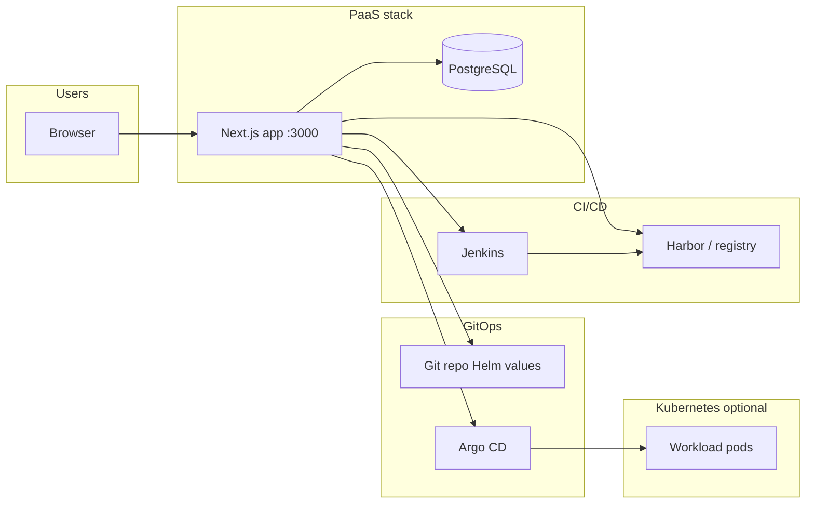
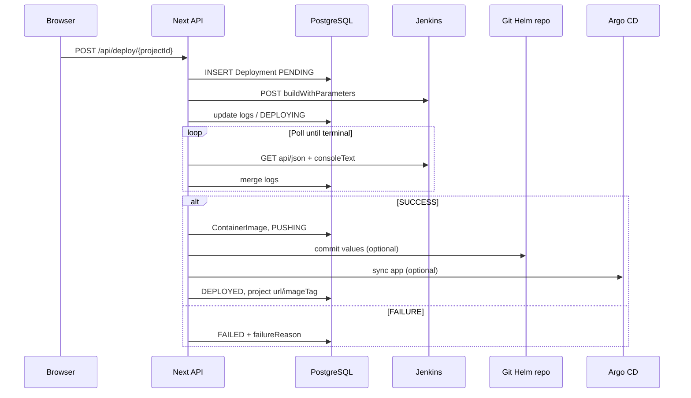
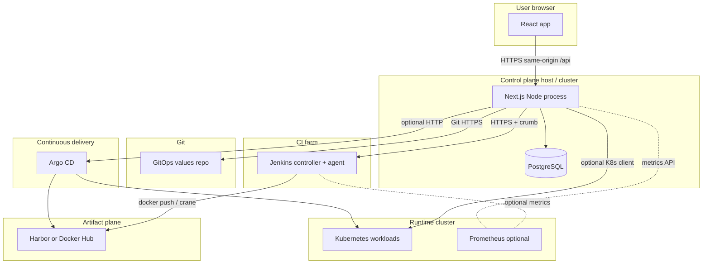
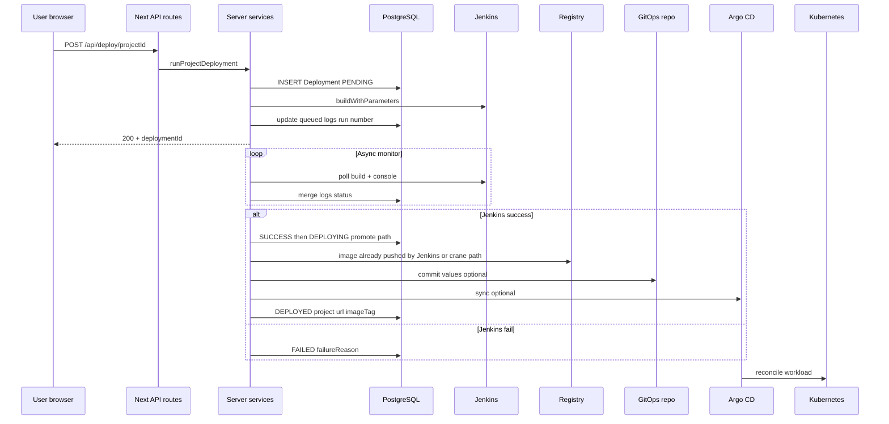

# DevSecOps PaaS — Project guide for presenters

This document explains what the repository contains, how the pieces connect, and how someone operates the system from the UI through to the cluster.

---

## 1. What this product is

**A self-hosted “control plane” web application** that lets development teams:

- Register **projects** (Git repo, branch, language, namespace).
- **Trigger builds** on **Jenkins** (or optionally **Tekton**).
- **Deploy** applications through **Harbor** (images), **Helm/GitOps** (values in Git), and **Argo CD** (sync to Kubernetes).
- See **security posture** (Dependency-Track, Trivy, Sonar-style quality gate, Cosign/OPA signals when configured).
- See **runtime signals** (Prometheus-backed CPU/memory, Kubernetes pod summaries when enabled, Grafana link).

There is **no separate Java microservice** in this path: the **Next.js app** in `paas/frontend` is the **full stack** (React UI, REST API routes under `src/app/api`, server-only integration code under `src/server`). Data is stored in **PostgreSQL** via **Prisma**.

---

## 2. Who uses it

| Role | Typical use |
|------|-------------|
| **Developer** | Own projects only: build, deploy, view logs, security/monitoring for those projects. |
| **Admin** | Same platform, broader access to operations and integrations as implemented in routes/guards. |

Authentication is **JWT + HTTP-only cookie**; email verification and password reset flows exist when SMTP is configured.

---

## 3. High-level architecture

**Typical deploy path (conceptual):**

1. User triggers **deploy** in the UI.
2. App creates a **Deployment** row, calls **Jenkins** with parameters (Git URL, branch, project id, registry hints, etc.).
3. Jenkins runs **`Jenkinsfile.paas-deploy`**: checkout, **application build**, **SCA** then **SAST** (non-fatal when tools or credentials are missing), Docker image build/registry push, Helm packaging, optional Artifactory/Cosign/ZAP/Helm-OCI, then the **PaaS** commits **Helm values** to Git and calls **Argo CD sync** when configured.
4. On success, the app updates **project** fields (e.g. image tag, URLs, logs) and marks the deployment **deployed** or **failed** with reasons.

---

## 4. Repository layout (what lives where)

| Path | Purpose |
|------|---------|
| `paas/frontend/` | Next.js 14 app: UI, API routes, Prisma schema, Docker build for the control plane. |
| `paas/jenkins/` | `Jenkinsfile.paas-deploy` (main pipeline), optional Groovy variants, Swarm compose example. |
| `paas/docker-compose.yml` | Local stack: Postgres, one-off Prisma migrate (`db-push`), `paas-frontend` with monorepo mount for Jenkinsfile sync. |
| `paas/docker/` | Dockerfiles used by compose (frontend image, db-push). |
| `paas/scripts/` | Operational Python/helpers (Harbor, Argo, SSH helpers) — not required for core UI dev. |
| `paas/terraform/`, `paas/k8s-manifests/`, `paas/gitops/` | Infra/manifest examples; adapt to your environment. |
| `paas/test-app/` | Sample app (submodule in some clones) for demos. |

---

## 5. Main user-facing areas (routes)

All under the dashboard after login (paths are illustrative; `uuid` is the project id):

| Area | Route pattern | Purpose |
|------|---------------|---------|
| Dashboard | `/dashboard` | Overview metrics and rollups. |
| Projects | `/projects`, `/projects/[id]` | Project CRUD, build/deploy actions, status. |
| Pipeline | `/pipeline/[id]` | Delivery path vs Jenkins log markers, build/deploy consoles. |
| Docker | `/docker/[id]` | Image/history oriented view. |
| Security | `/security/[id]` | Aggregated security metrics (when backends available or graceful fallbacks). |
| Monitoring | `/monitoring/[id]` | CPU/memory + pod status summary + Grafana link. |
| Cluster | `/cluster` | Cluster/workspace view, logs, recent deployments (K8s or DB-backed). |
| Deployments | `/deployments/[id]` | Single deployment poll page and logs. |
| Integrations | `/integrations` | Platform tool reachability/config overview. |
| Artifacts | `/artifacts` | Artifact listing UX as implemented. |

**API** lives under `/api/...` (same origin): projects, builds, deployments, auth, optional k8s proxy routes, Jenkins helpers, etc.

---

## 6. Data model (Prisma — simplified)

Core entities:

- **User** — identity, role, auth tokens relations.
- **Project** — name, Git URL, branch, namespace, `buildStatus`, `lastDeploymentStatus`, `podStatus`, log buffers, `imageTag`, optional `url`, soft-delete.
- **Deployment** — links to project, Jenkins/Tekton metadata, status, logs, failure reason/message.
- **ContainerImage** — promoted image records for audit.

The UI **polls** status endpoints and invalidates React Query caches after mutations.

---

## 7. Build backend

Controlled by **`BUILD_BACKEND`**: **`jenkins`** (default) or **`tekton`**.

- **Jenkins**: HTTP API with crumb, parameterized job names (`JENKINS_BUILD_JOB_NAME` / `JENKINS_DEPLOY_JOB_NAME` often shared as `paas-deploy`). Optional **inline sync** pushes `Jenkinsfile.paas-deploy` XML into Jenkins before trigger when `JENKINS_SYNC_INLINE_JOB_BEFORE_TRIGGER=true` and monorepo root is mounted.
- **Tekton**: Kubernetes API polling of `PipelineRun` resources (when configured).

---

## 8. Jenkins pipeline (`Jenkinsfile.paas-deploy`)

**Executed order on the controller** (Steps 1–12 in the inline job; see also `/pipeline/[id]` in the UI):

| Step | Stage (summary) | Role |
|------|-----------------|------|
| 1 | Params validation | `GIT_URL`, `BRANCH`, `IMAGE_NAME`, `PROJECT_ID`, optional `GIT_CREDENTIALS_ID`. |
| 2 | Git checkout | Clone from GitHub/Git (same as mémoire §2). |
| 3 | **Construction** | Compile/package (Maven, npm/Next, Python) — **before** SCA/SAST so dependencies and outputs exist (OWASP Dependency-Check / SBOM tools often need a resolved tree). |
| 4 | **SCA** | OWASP Dependency-Check + CycloneDX SBOM (`sca/`), optional upload to **Dependency-Track** — corresponds to mémoire §3. |
| 5 | **SAST** | SonarQube (Docker scanner or `npx sonarqube-scanner`) — mémoire §4. |
| 6 | **Docker image** | Build image; **registry push** (Harbor / Docker Hub / Jenkins credentials) is done in this step on the incremental file (*mémoire §6 + §9 combined*; the **`.full`** pipeline can push after Artifactory as chapter §9). Crane path pushes during layer upload. |
| 7 | **Helm package** | `helm package` → `paas-artifacts/helm/` — mémoire §7. |
| 8 | **Artifactory** | Optional bundle upload — mémoire §8. |
| 9 | **Cosign** | Optional image signing — mémoire §10. |
| 10 | **ZAP** (DAST) | Optional baseline scan if `ZAP_TARGET_URL` is set (extra hardening; not in the 13-point mémoire list). |
| 11 | **Helm OCI → Harbor** | Optional `helm push oci://…` — mémoire §11. |
| 12 | **GitOps handoff + Jenkins archive** | Log lines for Argo (mémoire §12–13); **`archiveArtifacts`** for `sca/**`, `paas-artifacts/**`. |

**After Jenkins**, the **Next.js control plane** (not inside the Groovy file) performs:

- **GitOps**: commit Helm values (image tag) — see `gitops-github-service`, `cluster-deploy-service`.
- **Argo CD**: `POST …/applications/{app}/sync` — see `argocd-service.ts`; **HTTP 403** means RBAC on the JWT (sync manually or widen token permissions). **`PAAS_STRICT_INTEGRATIONS`** controls whether that failure breaks the deployment.

Reference Groovy variant with chapter-numbered stages: **`Jenkinsfile.paas-deploy.full`**.

### 8.1 Mémoire DevSecOps — intégration dans ce dépôt (points 1–13)

The following maps the **mémoire** narrative to **this repository** (IHM + API + Jenkins + PaaS).

| # | Mémoire (résumé) | Où c’est implémenté dans le projet |
|---|------------------|-------------------------------------|
| **1** | Déclenchement depuis l’IHM / paramètres; webhook GitHub → prompt de build | **UI**: Projects → *Trigger build*, Pipeline page; **`GitHubPushBuildPrompt`** (`paas/frontend/src/components/build/github-push-build-prompt.tsx`) quand un push est enregistré; **API**: `POST /api/build/[projectId]` → `pipeline-service.triggerBuild` → `JenkinsClient` (crumb + `buildWithParameters`). Paramètres alignés avec `inline-paas-deploy-job-sync.ts` (`PARAMETER_DEFINITIONS`). |
| **2** | Checkout du code Git/GitHub | **Jenkins** `stage("Step 2 — Checkout…")` dans `Jenkinsfile.paas-deploy` (step **git** + logs). |
| **3** | SCA: Dependency-Check, NVD, JSON → SBOM CycloneDX → **Dependency-Track** | **Jenkins** `Step 4` + **`uploadBomToDependencyTrack`**; répertoire **`sca/`**; env **`NVD_API_KEY`**, **`DEPENDENCY_TRACK_*`**. **UI** agrège DT sur `/security/[id]` si configuré. |
| **4** | SAST **SonarQube** | **Jenkins** `Step 5`; env **`SONAR_HOST_URL`**, **`SONAR_TOKEN`** (params ou agent). **UI** Sonar agrégat si **`SONAR_BASE_URL`** côté app. |
| **5** | Construction / artefacts | **Jenkins** `Step 3` (Maven, npm/Next, Python); manifeste **`paas-artifacts/build-artifact-manifest.txt`**. *Ordre technique: étape 3 avant 4–5 pour résoudre dépendances et builds.* |
| **6** | Image Docker | **Jenkins** `Step 6` (Dockerfile ou **crane** sans Docker). |
| **7** | Packaging **Helm** | **Jenkins** `Step 7`; charts sous **`paas-artifacts/helm/`**. |
| **8** | **Artifactory** | **Jenkins** `Step 8`; env **`ARTIFACTORY_*`**, **`ARTIFACTORY_CREDENTIALS_ID`**. |
| **9** | Publication image **Harbor** (registre privé) | **Inclus dans Jenkins `Step 6`** sur le fichier *incremental* (push après `docker build` ou via crane). Variante **`Jenkinsfile.paas-deploy.full`**: stage dédié **§9** après Artifactory. |
| **10** | **Cosign** (signature OCI) | **Jenkins** `Step 9`; **`COSIGN_CREDENTIALS_ID`** ou **`COSIGN_PRIVATE_KEY`** sur l’agent. |
| **11** | Publication charts Helm vers **Harbor** (OCI) | **Jenkins** `Step 11`; **`HARBOR_*`**, **`HELM_OCI_*`**. |
| **12** | Déploiement **Argo CD** | **PaaS** après Jenkins: **`syncArgoApplication`** dans `argocd-service.ts`; nom d’app **`${ARGOCD_APP_PREFIX}-${projectName}`**. **Step 12** Jenkins = journalisation + archive (orchestration réelle côté cluster/UI Argo). |
| **13** | Récupération / sync du chart depuis Harbor | Assurée par **Argo CD** (source `oci://…` ou GitOps) une fois l’Application configurée; le pipeline imprime des repères **`[argocd]`** / **`[argocd-helm]`** en Step 12; pas d’appel Jenkins direct au contrôleur Argo. |

**Variables d’environnement** de référence: `paas/frontend/docker-compose.env.example` et `paas/frontend/src/server/config/env.ts`.

The **control plane** stores **tail of console logs** on deployments/projects for the UI; for long steps the pipeline uses **keepalive** patterns to avoid Jenkins durable-task timeouts on quiet output.

---

## 9. Post-build: GitOps and Argo CD

When Git and tokens are configured (`GITOPS_*`), the server can **commit Helm value updates** (image tag bump) to a repository. **Argo CD** (`ARGOCD_*`) can then **sync** the application. Failures are recorded on the deployment with reasons such as GitOps or Argo errors.

---

## 10. Security and policy features in the app

The security page aggregates:

- **SonarQube** quality gate (HTTP API) when `SONAR_BASE_URL` + token exist.
- **Dependency-Track** project metrics/findings when URL + API key exist.
- **Trivy** counts when a Trivy server URL is set.
- **Cosign** verify when a public key is present; policy text explains unsigned images.
- **OPA** HTTP eval when `OPA_EVAL_URL` is set; skipped when not configured.
- **Kyverno** policy listing when Kubernetes client is available and policy engine is Kyverno.

If an integration is missing or unreachable, the API is designed to **degrade gracefully** (zeros / unknown / short message) instead of failing the whole page.

---

## 11. Kubernetes integration

When **`KUBERNETES_ENABLED=true`** and kubeconfig is available to the process:

- **Cluster** pages can list pods/services/deployments (subject to RBAC).
- **Pod logs** can be fetched for namespaces tied to projects.
- **Project status** enriches `podStatus` with live counts.

When Kubernetes is off, pod status is derived from **deployment state** and short hints instead of staying stuck on “UNKNOWN”.

---

## 12. Running the stack locally (typical)

From **`paas/`** (not `paas/frontend/` alone, so compose resolution and env files behave as designed):

1. Copy `paas/frontend/docker-compose.env.example` → `paas/frontend/docker-compose.env` and fill **Jenkins**, DB override if needed, **Harbor**/**Argo** as in your lab.
2. Optionally add `paas/.env` for secrets (compose merges it after `docker-compose.env`; duplicate keys: last wins).
3. `docker compose up --build`  
   - Postgres on host **5433** → **5432** in container.  
   - `db-push` applies Prisma schema.  
   - **Frontend** on **3000** with monorepo mount at `/monorepo` for Jenkinsfile sync.

**Jenkins URL from inside the frontend container** must be reachable (often the VM LAN IP or `host.docker.internal` depending on Docker setup).

---

## 13. Configuration cheat sheet (grouped)

| Group | Variables (examples) |
|--------|----------------------|
| Core | `DATABASE_URL`, `JWT_SECRET`, `APP_BASE_URL`, SMTP for mail |
| Jenkins | `JENKINS_BASE_URL`, `JENKINS_USERNAME`, `JENKINS_API_TOKEN`, job name overrides, `PAAS_MONOREPO_ROOT`, sync flag |
| Registry / Helm OCI | `HARBOR_*`, `HELM_OCI_*` |
| GitOps | `GITOPS_REPO_URL`, `GITOPS_REPO_TOKEN`, path pattern |
| Argo | `ARGOCD_BASE_URL`, `ARGOCD_AUTH_TOKEN`, `ARGOCD_APP_PREFIX` |
| Security tools | `SONAR_*`, `DEPENDENCY_TRACK_*`, `TRIVY_*`, `COSIGN_*`, `OPA_*`, `POLICY_ENGINE` |
| Kubernetes | `KUBERNETES_ENABLED`, `KUBE_CONFIG_PATH`, TLS skip flags |
| Build backends | `BUILD_BACKEND`, Tekton variables if used |

Authoritative defaults and parsing: `paas/frontend/src/server/config/env.ts`.

---

## 14. Presenter checklist (demo flow)

1. Show **login** and **projects list**.
2. Open a **project**: Git URL, branch, namespace, current build/deploy status.
3. Trigger **build** (or show **pipeline** page with delivery path vs logs).
4. Open **deployment** row or **Cluster** recent deployments — show log buffer and optional Jenkins fetch.
5. Show **Security** (even partial data explains the integration story).
6. Show **Monitoring** + **Grafana** link.
7. Mention **integrations hub** for “what is configured vs reachable”.

---

## 15. Honest limitations to mention

- Full value assumes a working **Jenkins** job aligned with this repo’s **Jenkinsfile** and reachable **Harbor/Git/Argo** in your environment.
- **Tekton** path requires operational Tekton CRDs and RBAC.
- **Cosign/OPA** enforcement in the security **score** is only as accurate as your keys and endpoints; without them, the UI explains gaps rather than blocking the page.

---

## 16. Technical stack (control plane)

| Layer | Technology |
|-------|------------|
| Framework | **Next.js 14** (App Router): `paas/frontend/src/app/` |
| UI | **React 18**, **Tailwind CSS**, **Radix-style** primitives under `src/components/ui/` |
| Client data | **TanStack React Query** (`@tanstack/react-query`), toasts via **Sonner** |
| Server API | **Route Handlers** `route.ts` under `src/app/api/**` (Node runtime where set) |
| Persistence | **PostgreSQL** + **Prisma** 5 (`prisma/schema.prisma`, client in `src/server/db/prisma.ts`) |
| Validation | **Zod** (e.g. `src/server/config/env.ts`, auth/project payloads) |
| Outbound HTTP | **`fetch`** and **undici** via `src/server/http/integration-fetch.ts` (optional TLS skip via `INTEGRATIONS_TLS_SKIP_VERIFY`); Jenkins/Argo may use dedicated wrappers |
| K8s | **`@kubernetes/client-node`** when `KUBERNETES_ENABLED=true` (`src/server/integrations/kubernetes-client.ts`) |

Pages under `(dashboard)/` and `(auth)/` are mostly **`"use client"`** where hooks/query are used. Layout and metadata live in `layout.tsx` files.

---

## 17. Authentication and authorization

- **Login** posts to `/api/auth/login`; server verifies password (**bcrypt**), issues **JWT** (secret `JWT_SECRET`, expiry `JWT_EXPIRES_IN`), sets **HTTP-only cookie** (see `src/server/auth/session-cookie.ts`, `auth-tokens.ts`).
- **Session** read via `/api/auth/session`; **logout** clears cookie (`/api/auth/logout`).
- **Email verification** and **password reset** token tables: `EmailVerificationToken`, `PasswordResetToken`; mail via **nodemailer** when SMTP env is set.
- **Route protection**: `requireAuth(request, ["ADMIN","DEVELOPER"])` in `src/server/auth/auth-guard.ts` used by API handlers.
- **Project scope**: `assertProjectAccess` / `getProjectForUser` in `src/server/projects/project-service.ts` — developers restricted to `createdById === userId`.

---

## 18. HTTP API surface (Route Handlers)

Base URL is the same origin as the UI (e.g. `http://host:3000`). Below, **`[id]`** / **`[projectId]`** are path parameters. Methods are the typical REST usage unless noted.

**Auth**

| Path | Role |
|------|------|
| `POST /api/auth/login`, `register`, `logout` | Session lifecycle |
| `GET /api/auth/session` | Current user |
| `POST /api/auth/forgot-password`, `reset-password`, `verify-email`, `resend-verification` | Account recovery / verification |

**Projects & status**

| Path | Role |
|------|------|
| `GET|POST /api/projects` | List / create |
| `GET|PATCH|DELETE /api/project/[projectId]` | Single project CRUD-style |
| `POST /api/projects/detect-language` | Repo heuristic (JSON: `gitRepositoryUrl`, optional `branch`) |
| `GET /api/status/[projectId]` | Aggregate status (`getProjectStatus` → K8s overlay + project row) |
| `GET /api/projects/[id]/deployments`, `GET /api/projects/[id]/app-reachability` | History / HTTP probe to app URL |

**Build & deploy**

| Path | Role |
|------|------|
| `POST /api/build/[projectId]` | `triggerBuild` (Jenkins/Tekton) |
| `POST /api/deploy/[projectId]` | Create `Deployment`, trigger backend, start async monitor |
| `POST /api/rollback/[projectId]` | Rollback project metadata / logs |
| `GET /api/deployments/[id]` | Poll single deployment (optionally drives reconcile) |
| `POST /api/deployments/[id]/cancel` | Cancel path |
| `GET /api/deployments/recent` | Cross-project recent rows for dashboards |

**Cluster & metrics**

| Path | Role |
|------|------|
| `GET /api/k8s/pods`, `services`, `deployments` | Proxied K8s list |
| `GET /api/k8s/pod-logs` | Namespaced pod log fetch |
| `GET /api/metrics`, `GET /api/metrics/[projectId]` | Dashboard vs per-project Prometheus-derived CPU/RAM |
| `GET /api/dashboard/overview` | Rolled-up overview (K8s vs DB fallbacks) |

**Integrations & platform**

| Path | Role |
|------|------|
| `GET /api/platform/integrations`, `tooling`, `deploy-readiness` | Integration matrix and readiness |
| `GET /api/argocd/[projectId]` | Argo application health/sync JSON |
| `GET /api/security/[projectId]` | `getSecurityMetrics` |
| `GET /api/dependency-track` | Dependency-Track slice for pipeline UI |
| `GET /api/jenkins/builds`, `GET /api/jenkins/logs/[id]` | Jenkins dashboard helpers |

**Docker / artifacts / helpers**

| Path | Role |
|------|------|
| `POST /api/docker/[projectId]/build`, `push`, `GET .../history` | Docker flows as implemented |
| `GET /api/artifacts`, `GET /api/artifacts/[name]` | Artifact API |
| `POST /api/helpers/suggest-build`, `analyze-build-log` | Optional OpenAI-backed hints when `OPENAI_API_KEY` set |
| `POST /api/webhooks/github` | Push events → optional build prompt (`GITHUB_WEBHOOK_*`) |

**Health**

| Path | Role |
|------|------|
| `GET /api/health` | Liveness |

Exact file paths mirror URL segments: e.g. `src/app/api/deploy/[projectId]/route.ts`.

---

## 19. Server module map (where logic lives)

| Area | Primary modules |
|------|-----------------|
| Build abstraction | `src/server/build-backend.ts` — `BuildBackend` interface; `build-backend-jenkins.ts`, `build-backend-tekton.ts` |
| Build planning | `src/server/build-planner.ts`, `build-metadata.ts`, `deploy/deploy-image.ts` |
| Pipeline orchestration | `src/server/pipeline/pipeline-service.ts` — trigger, rollback, `getProjectStatus` |
| Deploy promotion | `src/server/services/cluster-deploy-service.ts` — post-Jenkins success → image row, GitOps commit, Argo sync |
| Deployment persistence | `src/server/services/deployment-service.ts`, `deployment-failure.ts`, `jenkins-deployment-reconcile.ts`, `jenkins-monitor.ts` |
| Jenkins REST | `src/server/integrations/devsecops-clients.ts` (`JenkinsClient`), inline XML sync `src/server/jenkins/inline-paas-deploy-job-sync.ts`, `sync-inline-pipeline-job.ts` |
| GitOps | `src/server/gitops/gitops-github-service.ts` |
| Argo | `src/server/services/argocd-service.ts` (+ `src/server/http/argocd-fetch.ts`) |
| Security metrics | `src/server/security/security-service.ts`, `cosign-verify.ts`, `opa-eval.ts` |
| K8s | `src/server/integrations/kubernetes-client.ts` |
| Auth | `src/server/auth/auth-service.ts`, `auth-guard.ts`, `auth-mailer.ts` |
| Projects | `src/server/projects/project-service.ts` |
| Dashboard | `src/server/services/dashboard-overview-service.ts`, `metrics/metrics-service.ts` |
| HTTP helpers | `src/server/http/response.ts` (`ok`/`fail`), `integration-fetch.ts`, `format-fetch-error.ts`, `errors.ts` (`IntegrationError`) |

---

## 20. Build and deploy execution path (server-side)

**Build-only (`POST /api/build/[projectId]`)**

1. `pipeline-service.triggerBuild` loads project, resolves `ResolvedBuildPlan`, calls `getBuildBackend().triggerBuild`.
2. Jenkins path: HTTP **POST** job build (with parameters), optional **CSRF crumb**; optional **config.xml** push for inline Pipeline job before trigger.
3. Project row updated: `buildStatus` e.g. `BUILDING` / `QUEUED`, `buildLogs` tail.

**Full deploy (`POST /api/deploy/[projectId]`)**

1. `deployment-service` creates `Deployment` row (`PENDING`), calls `triggerDeployment` on backend.
2. Backend returns `runId` / `runNumber`, queue URL, etc.; logs merged into deployment row.
3. **`monitorDeployment`** (async): polls Jenkins `api/json` and progressive **consoleText** until terminal `result` or timeout.
4. On **`SUCCESS`**: `promoteDeploymentAfterJenkinsSuccess` / `promoteDeploymentAfterBuildSuccess` — updates project `buildStatus` to `PUSHING`, writes **ContainerImage**, runs **Helm values commit**, **Argo sync**, then marks deployment **DEPLOYED** and project `lastDeploymentStatus` / `url` / `imageTag`.
5. On failure: `recordDeploymentFailure` sets `deployment.status` **FAILED**, `failureReason` enum, `failureMessage`, updates project `lastDeploymentStatus`; Jenkins-like failures also set `buildStatus` **FAILED** when appropriate.

**Baseline / duplicate-build guard**

- `priorJenkinsBuildNumber` on `Deployment` avoids treating an old Jenkins build as the new run (`jenkins-deployment-reconcile.ts`, Jenkins backend polling).

Log tail length caps (e.g. `DEPLOYMENT_LOG_TAIL_MAX_CHARS` in `src/server/constants/deploy.ts`) prevent unbounded DB growth.

---

## 21. Database schema (Prisma) — technical detail

**`User`** — `role`: `ADMIN` | `DEVELOPER` (enum `Role`). Relations: `projects[]`, `deployments[]` (as triggerer), token tables.

**`Project`** — Soft delete: `deletedAt` (queries filter active). **Operational fields**: `buildStatus`, `lastDeploymentStatus`, `podStatus` (string mirrors, not K8s-native enums), `buildLogs` / `deploymentLogs` (long text buffers for UI), `imageTag`, `url` (public app URL), `gitCredentialsId` (Jenkins credential id), `pendingGitHubPush` (JSON for post-push build UX).

**`Deployment`** — `status`: `DeploymentJobStatus` (`PENDING`, `SUCCESS`, `FAILED`, `DEPLOYING`, `DEPLOYED`). After Jenkins succeeds, the row can transition **`SUCCESS`** (build artifact persisted) → **`DEPLOYING`** (GitOps / Argo handoff) → **`DEPLOYED`**. **Jenkins**: `jenkinsBuildNumber`, `priorJenkinsBuildNumber`. **Failure**: `failureReason` ∈ `JENKINS` \| `GITOPS` \| `ARGOCD` \| `IMAGE_REF` \| `TRIGGER` \| `TIMEOUT` \| `UNKNOWN`, plus `failureMessage`. **`url`**: optional deployed app URL on success path.

**`ContainerImage`** — Audit trail of promoted images (`imageRef`, `registry`, `action`, `digest`, `logs`).

Prisma **generator** targets `native` and `linux-musl-openssl-3.0.x` for Alpine-compatible CI images.

---

## 22. Jenkins integration (technical)

- **Base URL**: `JENKINS_BASE_URL` must match Jenkins **System** “Jenkins URL” host; host header mismatches often yield **403**.
- **Auth**: Basic auth with **user + API token** (not password) in `Authorization` header.
- **Job naming**: `JENKINS_JOB_NAME_SOURCE` **`projectName`** (sanitized slug) vs **`uuid`** (project id). Shared job names via `JENKINS_BUILD_JOB_NAME` / `JENKINS_DEPLOY_JOB_NAME` (e.g. both `paas-deploy`). **Folder** jobs: `JENKINS_JOB_FOLDER` → path segments `job/.../job/name`.
- **Parameters**: Build/deploy append registry, Sonar, Dependency-Track, Harbor, Helm OCI, Artifactory, proxy/npm registry, etc. from env (see `appendRegistryParameters` in `devsecops-clients.ts`).
- **Inline sync**: Reads `paas/jenkins/Jenkinsfile.paas-deploy` from `PAAS_MONOREPO_ROOT` or upward walk from `cwd`, POSTs **Pipeline XML** to `/job/{name}/config.xml` when enabled.
- **Long-running shell**: Pipeline uses `run_with_keepalive` so the **parent** shell prints periodically (mitigates **JENKINS-48300** durable-task timeout). JVM flag `BourneShellScript.HEARTBEAT_CHECK_INTERVAL` (see `swarm-jenkins.example.yml`) is an additional mitigation.

---

## 23. Security API behavior (technical)

`getSecurityMetrics` composes parallel calls: Sonar **quality gate** API, Dependency-Track **project** + **findings**, **Trivy** scan POST, **Cosign verify** (subprocess), **Kyverno** policy list (if K8s + engine), **OPA** POST (if URL set). **Scoring** is heuristic (severity weights + gate penalties). **Unconfigured** external services return fallbacks (no hard failure on `fetchOrFallback` when integration URL absent). **Hard failures** are caught and returned as a **degraded** `SecurityMetrics` payload with `qualityGateStatus: UNKNOWN` and explanatory `securitySummary`.

---

## 24. Sequence (deploy) — condensed

---

## 25. File index (quick)

| Artifact | Path |
|----------|------|
| Env schema | `paas/frontend/src/server/config/env.ts` |
| Compose stack | `paas/docker-compose.yml` |
| Compose env template | `paas/frontend/docker-compose.env.example` |
| Main Jenkins pipeline | `paas/jenkins/Jenkinsfile.paas-deploy` |
| Prisma schema | `paas/frontend/prisma/schema.prisma` |
| Client API wrapper | `paas/frontend/src/lib/api.ts` |

---

## 26. How to find things in the code (navigation)

- **UI page for a project** → `paas/frontend/src/app/(dashboard)/projects/[id]/page.tsx` — this is the richest example of **React Query** keys, **mutations** (build / deploy / rollback), and **invalidation** after success.
- **“What happens when I hit this API?”** → `paas/frontend/src/app/api/<segment>/.../route.ts` — export `GET` / `POST` / `PATCH` / `DELETE` matching the HTTP verb.
- **Business logic not tied to HTTP** → `paas/frontend/src/server/**` — prefer reading **services** (`deployment-service`, `cluster-deploy-service`) and **pipeline** (`pipeline-service`) before diving into `devsecops-clients`.
- **Env names and defaults** → single source: `src/server/config/env.ts` (Zod parse).
- **DTOs the UI and API share** → `paas/frontend/src/types/**` (imported as `@/types`).

Quick greps that pay off in review prep:

- `requireAuth(` — see every protected route’s role list.
- `assertProjectAccess(` — project-scoped endpoints.
- `getBuildBackend(` / `resolveBuildPlan(` — any path that touches CI.
- `queryKey:` — client cache boundaries.

---

## 27. API route handler pattern (repeated recipe)

Most write routes follow the same shape (example: **`POST /api/deploy/[projectId]`** in `route.ts`):

1. `export const runtime = "nodejs"` — Prisma and long integrations expect Node, not Edge.
2. `requireAuth(request, ["ADMIN","DEVELOPER"])` — JWT from **`Authorization: Bearer`** **or** session cookie (see `auth-guard.ts` `resolveToken`).
3. **`enforceRateLimit`** (where used) — in-memory keyed limiter (`src/server/http/rate-limit.ts`); tune `keyPrefix`, window, `maxRequests`.
4. **`assertProjectAccess(projectId, userId, role)`** — developers only see their projects; admins see all (implementation in `project-service.ts`).
5. Call a **server service** (e.g. `runProjectDeployment`) — keep orchestration out of the route file.
6. **`ok(payload)`** or **`fail(error)`** — `fail` unwraps **`ApiError`** → JSON `{ message, details?, ...data }` with the right status (`src/server/http/response.ts`).
7. **`writeAuditLog`** on success/failure for sensitive actions (build/deploy).

Missing auth → **401**; wrong role → **403**; validation → **400** via `ValidationError` / Zod in route; integration outages often surface as **`IntegrationError` (502)** with `details` for upstream body or message.

---

## 28. Browser client: Axios, cookies, and React Query

**`api-client.ts`** — Axios instance with `withCredentials: true` so **HTTP-only session cookies** ride on same-origin requests. Optional **`NEXT_PUBLIC_API_BASE_URL`**: if set, it becomes the origin prefix (trailing `/api` is stripped so paths stay `/api/...`).

**Dual JWT path**: Interceptor adds **`Authorization: Bearer`** from `authStorage.getToken()` when present. Server **`requireAuth`** accepts **either** header or cookie — useful if some flows store a token client-side while login still sets the cookie.

**`lib/api.ts`** — Typed facades: `authApi`, `projectApi`, `pipelineApi`, `metricsApi`, `securityApi`, `platformApi`, `kubernetesApi`, `dockerApi`, `jenkinsUi`, etc. Prefer calling these from components instead of raw `fetch` so URLs and types stay consistent.

**React Query** — Wrapped in **`QueryProvider`** (`lib/query-provider.tsx`); root layout nests **`AuthProvider`** → **`QueryProvider`** (`app/layout.tsx`).

**Example query keys** (from the project detail page): `["project", projectId]`, `["status", projectId]`, `["deployments", projectId]`, `["argocd", projectId]`, `["app-reachability", projectId]`, `["security", projectId]`. After **build**: invalidate `status` + `project`. After **deploy**: also invalidate `argocd`, `deployments`, `app-reachability`.

**401 handling**: Response interceptor clears `authStorage` and redirects to `/login` unless path is public or the request was session check.

---

## 29. `BuildBackend` interface (the CI abstraction)

Defined in **`src/server/build-backend.ts`**. Implementations: **`JenkinsBuildBackend`**, **`TektonBuildBackend`**. Factory: **`getBuildBackend()`** — memoized singleton chosen by **`resolveBuildProvider()`** from env (`jenkins` vs `tekton`).

| Method | Purpose |
|--------|---------|
| `provisionProjectIntegration` | Optional setup hook for the provider. |
| `triggerBuild` | Build-only; used by **`pipeline-service.triggerBuild`**. |
| `getDeploymentBaseline` | e.g. “last known Jenkins build number” stored as **`Deployment.priorJenkinsBuildNumber`**. |
| `triggerDeployment` | Full deploy pipeline trigger; used by **`runProjectDeployment`**. |
| `monitorDeployment` | Long-running poll until terminal state; updates DB logs/status and invokes promotion on success. |

**`BuildTriggerResult`**: `accepted`, `provider`, `runId`, `runNumber`, `logs`, optional `externalUrl`, `artifactImage`, `artifactDigest`. Downstream code always checks **`accepted`** before assuming the run exists.

---

## 30. Deployment flow in code (details people ask about)

**`runProjectDeployment`** (`deployment-service.ts`):

- Loads project; **rejects with 409** if another row is **`PENDING`** or **`DEPLOYING`** for that project (concurrency guard).
- **`effectiveTriggerUserId`**: optional env **`DEPLOYMENT_TRIGGER_USER_ID`** overrides who is stored as **`triggeredById`** (automation demos).
- Creates **`Deployment`** with **`priorJenkinsBuildNumber`** = baseline from backend.
- **`triggerDeployment`**: on failure, **`recordDeploymentFailure`** with **`TRIGGER`** and rethrows **`IntegrationError`** often including **`deploymentId`** in `data`.
- On success: trims initial logs to **`DEPLOYMENT_LOG_TAIL_MAX_CHARS`** (5000 in `constants/deploy.ts`), updates **`jenkinsBuildNumber`**, sets project **`lastDeploymentStatus` / `buildStatus`** to **`QUEUED`**, clears **`pendingGitHubPush`**.
- **`monitorDeployment(id, runNumber)`** — **fire-and-forget** (`void` + `.catch` in `jenkins-monitor.ts`); errors in the monitor loop become **`UNKNOWN`** failure if unhandled.

**`monitorDeployment` wrapper** builds a synthetic **`startedRun`** from DB + `initialBuildNumber` so **`BuildBackend.monitorDeployment`** always sees a consistent shape.

**Polling the deployment row** — **`GET /api/deployments/[id]`** → **`getDeploymentForUser`**: if status is **`PENDING`** or **`DEPLOYING`**, it calls **`reconcileJenkinsDeploymentRecord`** first so refreshes pull fresh Jenkins state without waiting for the async monitor tick.

**Cancel** — **`cancelRunningDeploymentForUser`**: Jenkins-only; **`stopBuild`** + cancel queue; then **`reconcileJenkinsDeploymentRecord`** after a short delay.

---

## 31. Log lines: `[build-meta]` (structured breadcrumbs in plain text)

**`build-metadata.ts`** prepends lines like `[build-meta] key=value` into log buffers. **`parseBuildMetadata(logs)`** scans the deployment’s **`logs`** text and extracts **`provider`**, **`runId`**, **`runNumber`**, **`artifactImage`**, **`artifactDigest`**, plus plan fields (**`profile`**, **`mode`**, templates).

API list responses use that parser so the UI can show **artifact image/digest** without extra columns. If someone asks “where does the UI get `artifactImage` for a deployment?” — **from the log prefix lines**, not only from Prisma fields.

---

## 32. Errors and status codes (server)

**`ApiError` subclasses** (`http/errors.ts`): **`UnauthorizedError` 401**, **`ForbiddenError` 403**, **`NotFoundError` 404**, **`ValidationError` 400**, **`SecurityGateError` 422**, **`IntegrationError` 502** (external tool failure; often carries **`details`**).

**`fail()`** in `response.ts` serializes **`ApiError`** to JSON and passes through optional **`data`** (e.g. **`deploymentId`**, **`jobUrl`**). Non-`Error` failures become **500** with a generic message.

---

## 33. Likely technical questions (short answers)

- **Why both cookie and Bearer in auth?** Cookie is the primary session for the browser; Bearer allows the same routes to be called with an explicit token and matches common API client patterns.
- **Where is deploy “after Jenkins succeeds”?** **`cluster-deploy-service`** (promote: **`ContainerImage`**, GitOps commit, Argo sync) — called from the Jenkins backend’s monitor path when **`result`** is success.
- **Why `priorJenkinsBuildNumber`?** So polling and reconcile can ignore an **older** Jenkins build still showing in **`/lastBuild`** APIs when job names are shared.
- **Why is monitor fire-and-forget?** HTTP response returns immediately with **`deploymentId`**; work continues in-process. **Restarting the Next server** can interrupt an in-flight monitor (document honestly for ops).
- **Where is Tekton different?** Same **`BuildBackend`** methods; **`build-backend-tekton.ts`** implements polling of **`PipelineRun`** instead of Jenkins queue/build APIs; cancel from UI may be limited (deploy cancel checks **`provider !== "jenkins"`** → 501).
- **Single job name for build and deploy?** Supported via **`JENKINS_BUILD_JOB_NAME` / `JENKINS_DEPLOY_JOB_NAME`**; pipeline parameters distinguish intent; folder jobs use **`JENKINS_JOB_FOLDER`** path segments.
- **How does project status mix DB and K8s?** **`getProjectStatus`** starts from **`mapProjectToResponse`**; if **`KUBERNETES_ENABLED`**, merges **`getNamespacePodSummary`** for live counts/errors (`pipeline-service.ts`).

---

## 34. Full architecture description (end-to-end)

This section ties together **what runs where**, **who talks to whom**, and **how a user action becomes a cluster state**, at a depth suitable for architecture reviews and onboarding.

### 34.1 Problem the solution solves

Teams need a **single place** to:

- Own application **metadata** (repo, branch, namespace, credentials IDs) without hand-editing Jenkins or YAML for every action.
- **Trigger** CI/CD (Jenkins by default, Tekton optionally) with parameters that stay consistent with the control plane config.
- **Observe** build/deploy progress, logs, and outcomes in the UI rather than only in Jenkins.
- **Gate and visualize** security and policy signals (SCA/SAST/image scan/signing/policy) when those backends exist.
- **Optional:** reconcile **Kubernetes** live state (pods, services, deployments, logs) and **GitOps/Argo** health into the same UX.

The implementation choice is a **control plane monolith** (Next.js) that is both UI and API, plus **PostgreSQL** for authoritative platform state, and **best-effort integrations** to external tools over HTTP/API and optional in-cluster clients.

### 34.2 Logical architecture (layers)

| Layer | Responsibility | Primary location |
|--------|----------------|------------------|
| **Presentation** | Dashboard pages, forms, charts; TanStack Query for server state; Axios client with credentials | `src/app/(dashboard)/**`, `src/lib/api.ts`, `src/lib/api-client.ts` |
| **Edge API** | AuthN/AuthZ, rate limits, validation, audit hooks, HTTP mapping | `src/app/api/**/route.ts` |
| **Application services** | Orchestration: deployments, pipeline triggers, dashboard rollups, security composition | `src/server/services/**`, `src/server/pipeline/**`, `src/server/security/**` |
| **Domain / persistence** | Prisma access, project scoping, deployment records | `src/server/projects/**`, `src/server/db/**`, `prisma/schema.prisma` |
| **Integration adapters** | Jenkins REST, Tekton/K8s, Harbor/Helm patterns, Argo REST, GitOps Git, Sonar/DT/Trivy/etc. | `src/server/integrations/**`, `src/server/gitops/**`, `src/server/jenkins/**` |
| **External systems** | Jenkins, registry, optional K8s API, optional Prometheus, tool URLs | Your infrastructure |

**Important boundary:** business rules that must stay consistent (who can deploy, concurrent deployment guard, deployment status transitions) live in **server services**, not in the React layer. The UI only reflects API results and triggers mutations.

### 34.3 Runtime / physical view

Typical production-style layout (exact hosts vary):

The **frontend container** often mounts the monorepo read-only so it can read `paas/jenkins/Jenkinsfile.paas-deploy` for **inline Pipeline job sync** into Jenkins before trigger (`JENKINS_SYNC_INLINE_JOB_BEFORE_TRIGGER`).

### 34.4 Identity, authorization, and multi-tenancy

- **Authentication:** JWT stored in an **HTTP-only cookie** for browsers; **`Authorization: Bearer`** also accepted for API-style clients. Verification in `auth-guard.ts` loads the user from DB (so resets survive token issue).
- **Roles:** **`ADMIN`** vs **`DEVELOPER`** (`Role` enum). Developers are **scoped to projects where `createdById` matches** (`assertProjectAccess`); admins bypass that filter for project operations as implemented.
- **Audit:** Sensitive actions (e.g. build/deploy triggers) write **`writeAuditLog`** entries where wired.

Multi-tenancy is **logical** (per-user project ownership), not hard Kubernetes isolation: all projects share the same platform instance and integration credentials unless you split deployments by environment.

### 34.5 Core domain state (what the platform “is responsible for”)

- **Project** — Desired state: Git URL, branch, namespace, feature flags (auto Dockerfile/Helm), operational mirrors (`buildStatus`, `lastDeploymentStatus`, `podStatus`), long text logs for UX, optional `url` / `imageTag`, soft delete.
- **Deployment** — One **attempt** to run a pipeline for a project: Jenkins/Tekton run identity, **status machine** (`PENDING` → `DEPLOYING` → `SUCCESS` / GitOps handoff → `DEPLOYED`, or `FAILED`), **failure reason** enum, **log buffer** (tailed), **`priorJenkinsBuildNumber`** anti-confusion baseline.
- **ContainerImage** — Audit of **promoted** images (registry ref, digest, action) after successful CI path.
- **User + tokens** — Accounts, email verification / reset tokens when SMTP enabled.

The control plane is **not** the source of truth for Kubernetes object YAML; it reflects outcomes (URLs, tags, optional live pod counts) and drives **GitOps commits** / **Argo sync** when configured.

### 34.6 Build-backend abstraction (Jenkins vs Tekton)

All CI entry points go through **`BuildBackend`** (`build-backend.ts`):

- **`triggerBuild`** — Build-only; updates **project** row (no `Deployment` row required for a simple build in the current design).
- **`triggerDeployment`** + **`getDeploymentBaseline`** + **`monitorDeployment`** — Full path: create/update **Deployment**, poll until terminal Jenkins (or Tekton) state, then **promote** or **record failure**.

Switching backends is **`BUILD_BACKEND`** (`jenkins` default, `tekton` alternative). Tekton path requires **`KUBERNETES_ENABLED`** and working cluster access from the Next process.

### 34.7 End-to-end flow: user login → session

1. Browser **`POST /api/auth/login`** with email/password.
2. Server validates password (bcrypt), mints JWT, sets cookie (`session-cookie.ts`).
3. **`GET /api/auth/session`** returns user profile; **React Query** / **`AuthProvider`** keep client state in sync.
4. Subsequent **`/api/*`** calls send cookie (and may add Bearer from local storage via Axios interceptor).

### 34.8 End-to-end flow: register project

1. User submits project form → **`POST /api/projects`** (or create flow).
2. Route validates payload (Zod where used), **`requireAuth`**, persists **Project** with **`createdById`**.
3. List views **`GET /api/projects`** filter on role.

### 34.9 End-to-end flow: build-only

1. UI calls **`POST /api/build/[projectId]`** (`pipeline-service.triggerBuild`).
2. Server **`assertProjectAccess`**, optional rate limit, **`resolveBuildPlan`**, **`getBuildBackend().triggerBuild`**.
3. **Jenkins:** parameterized job trigger (crumb), optional inline `config.xml` sync from monorepo `Jenkinsfile.paas-deploy`; response updates **`buildStatus`**, **`buildLogs`** on **Project**.
4. **Tekton:** creates/observes `PipelineRun` per `build-backend-tekton.ts`.
5. UI invalidates **`["status", projectId]`** and **`["project", projectId]`** queries.

No **`Deployment`** row is required for this path; monitoring is project-centric.

### 34.10 End-to-end flow: full deploy (detailed)

This is the longest path and the heart of the product.

**Synchronous part (HTTP request)**

1. **`POST /api/deploy/[projectId]`** → **`runProjectDeployment`**.
2. **Concurrency:** if another row is `PENDING` or `DEPLOYING` for that project → **409** with existing `deploymentId`.
3. **Plan + baseline:** `resolveBuildPlan`, `getBuildBackend().getDeploymentBaseline()` → e.g. last Jenkins number → stored as **`priorJenkinsBuildNumber`**.
4. **Row created:** **`Deployment`** in `PENDING` with empty logs.
5. **Trigger:** `backend.triggerDeployment(project, plan)` — on hard failure → **`recordDeploymentFailure`** (`TRIGGER`) and **502**-style error to client with `deploymentId` when possible.
6. **Accepted:** trim logs, set **`jenkinsBuildNumber`/metadata**, set project **`QUEUED`**, **`monitorDeployment(deploymentId, runNumber)`** fired without awaiting completion.
7. **Response:** JSON with **`deploymentId`** and message to poll **`GET /api/deployments/:id`**.

**Asynchronous part (monitor loop)**

8. **`BuildBackend.monitorDeployment`** (Jenkins: poll `api/json` + `consoleText`, respect baseline).
9. **While running:** merge console output into **`Deployment.logs`** (capped by `DEPLOYMENT_LOG_TAIL_MAX_CHARS`), status often **`DEPLOYING`**.
10. **Failure:** **`recordDeploymentFailure`** with enum reason (`JENKINS`, `TIMEOUT`, etc.) and message; project **`lastDeploymentStatus`** updated.
11. **Success:** **`promoteDeploymentAfterJenkinsSuccess`** (cluster-deploy-service): persist artifact metadata (`ContainerImage`), optional **GitOps commit** (image tag in values repo), optional **Argo CD sync** HTTP call, set **`DEPLOYED`** / project `url` / `imageTag` as applicable.

**Client observation**

12. **`GET /api/deployments/[id]`** for active rows calls **`reconcileJenkinsDeploymentRecord`** first to reduce staleness.

### 34.11 Rollback and cancel

- **Rollback** (`POST /api/rollback/[projectId]`) updates **project** operational strings (simplified rollback narrative in `pipeline-service.rollbackProject`); it is not a Kubernetes `kubectl rollout undo` by itself unless extended.
- **Cancel** (`POST /api/deployments/:id/cancel`) is **implemented for Jenkins**: stop build, cancel queue items, **`reconcileJenkinsDeploymentRecord`**. Tekton cancel returns **501** from the service when backend is not Jenkins.

### 34.12 Security and observability surfaces (architecture)

- **Per-project security page:** **`getSecurityMetrics`** composes parallel calls (Sonar gate, Dependency-Track metrics/findings, Trivy scan, Cosign verify subprocess, optional Kyverno policy list via K8s client, OPA HTTP if configured). Scoring is **heuristic**; missing tools **degrade** with partial payloads.
- **Dashboard overview:** aggregates **cluster** (K8s or project rollups), **deployments**, **artifacts**, **platform tooling reachability**, and **security rollups** from multiple `getSecurityMetrics` samples for charting.

### 34.13 Kubernetes optional path

When **`KUBERNETES_ENABLED=true`** and kubeconfig (or in-cluster config) loads:

- **Cluster** pages and **`/api/k8s/*`** proxy **list/get** operations through **`@kubernetes/client-node`** with RBAC as granted.
- **`getProjectStatus`** enriches pod summaries for a **project namespace**.
- **Security** may include Kyverno-related policy signals when `POLICY_ENGINE` aligns.

When disabled, the UI uses **DB-backed rollups** and strings so pages remain usable.

### 34.14 Jenkins pipeline vs control plane split

- **Jenkins** runs **`Jenkinsfile.paas-deploy`** (or a minimal variant during incremental testing): checkout, **build**, then **SCA/SAST** (often non-fatal), image build/push (Docker or crane path), optional Cosign/ZAP/Helm OCI, archives. It prints **`PAAS_ARTIFACT_IMAGE=...`** for log consumers.
- **Control plane** does **not** execute Maven/npm inside Next.js**; it **orchestrates** Jenkins and then **promotes** and **records** outcomes in Postgres.

A **full** Groovy backup may live in **`Jenkinsfile.paas-deploy.full`** while **`Jenkinsfile.paas-deploy`** is trimmed for step-by-step bring-up; inline sync pulls the filename the PaaS expects.

### 34.15 Configuration and secrets (architecture level)

- **Single schema:** `src/server/config/env.ts` (Zod) defines what the app reads.
- **Categories:** database JWT, Jenkins, registries, GitOps, Argo, security tool URLs, Kubernetes, build backend, optional OpenAI for helpers, webhooks.
- **Compose:** `paas/docker-compose.yml` wires Postgres + frontend; `frontend/docker-compose.env` is the usual operator-facing env file.

Treat the **Next process** as holding **integration secrets** (API tokens, kubeconfig path); protect host/network access accordingly.

### 34.16 Failure modes (what to expect)

- **Integration down:** routes return **`IntegrationError`** (often 502) with a message; security APIs **soft-fail** per integration.
- **Jenkins URL/crumb mismatch:** 403 or failed trigger; documented in troubleshooting notes.
- **Long builds:** pipeline uses **keepalive** patterns; DB **log tails** capped to avoid unbounded growth.
- **Process restart** during `monitorDeployment`: in-flight poll may stop until next reconcile/poll — document for SREs.

### 34.17 Summary sentence

**The solution is a Postgres-backed control plane (Next.js) that authenticates users, owns project and deployment records, drives Jenkins (or Tekton) as the execution engine for builds and image production, optionally commits GitOps changes and triggers Argo CD, optionally reads Kubernetes and metrics APIs, and presents a unified dashboard for delivery and security posture.**

---

## 35. Choix technologiques (stack catégorisée)

Vue d’ensemble des **technologies réellement utilisées** dans ce dépôt (control plane + intégrations + pipeline), classées par rôle. Les versions précises sont dans `paas/frontend/package.json`, `docker-compose.yml` et les Dockerfiles.

### 35.1 Interface utilisateur (frontend)

| Technologie | Rôle dans la solution |
|-------------|------------------------|
| **Next.js 14** (App Router) | Framework full-stack : pages React + API Routes (`src/app/api`). |
| **React 18** | Composants UI, état local, hooks. |
| **TypeScript** | Typage du frontend et du code serveur partagé. |
| **Tailwind CSS** + **PostCSS** + **Autoprefixer** | Styles utilitaires, design system léger. |
| **Radix UI** (`@radix-ui/react-slot`) | Primitives accessibles (composition des boutons / patterns UI). |
| **class-variance-authority**, **clsx**, **tailwind-merge** | Variants de composants et fusion de classes. |
| **TanStack React Query v5** | Cache, requêtes, polling, invalidation après mutations. |
| **Axios** | Client HTTP navigateur vers `/api/*` (`withCredentials`, intercepteurs 401). |
| **jwt-decode** | Décodage côté client si besoin (session complémentaire au cookie). |
| **Recharts** | Graphiques (dashboard, sécurité). |
| **Sonner** | Toasts / notifications. |
| **Lucide React** | Icônes. |
| **next-themes** | Thème clair/sombre. |
| **Fontsource Space Grotesk** | Police locale embarquée. |

### 35.2 Backend applicatif (même codebase Next.js)

| Technologie | Rôle |
|-------------|------|
| **Node.js** (runtime **20** en image Docker, voir `docker/frontend.Dockerfile`) | Exécution du serveur Next production et des route handlers. |
| **Next.js Route Handlers** | Endpoints REST sous `src/app/api/**/route.ts` (souvent `runtime = "nodejs"` pour Prisma / intégrations). |
| **Zod** | Validation des variables d’environnement (`env.ts`) et de certains corps de requête. |
| **Prisma 5** | ORM + client généré, migrations / `db push`, schéma PostgreSQL. |
| **bcryptjs** | Hachage des mots de passe. |
| **jsonwebtoken** | Émission / vérification JWT (session). |
| **nodemailer** | Envoi mail (vérification compte, reset mot de passe) si SMTP configuré. |
| **undici** | Client HTTP côté serveur (chemins « integrations », timeouts TLS). |
| **yaml** | Parsing / manipulation YAML si besoin côté serveur. |

### 35.3 Données et persistance

| Technologie | Rôle |
|-------------|------|
| **PostgreSQL 16** (image **Alpine** dans Docker Compose) | Base transactionnelle : utilisateurs, projets, déploiements, tokens, images. |
| **Prisma Migrate / db push** | Évolution du schéma ; conteneur one-shot `db-push` en compose. |
| **Cibles binaires Prisma** | `native` + `linux-musl-openssl-3.0.x` pour images Alpine CI/prod. |

### 35.4 Intégration Kubernetes (optionnelle)

| Technologie | Rôle |
|-------------|------|
| **@kubernetes/client-node** | Client API Kubernetes depuis le process Next (pods, services, deployments, logs, CRD selon code). |
| **Kubeconfig fichier** ou **compte de service in-cluster** | Auth auprès du cluster (`KUBE_CONFIG_PATH`, `KUBERNETES_ENABLED`). |

### 35.5 CI/CD exécuté hors control plane

| Technologie | Rôle |
|-------------|------|
| **Jenkins** (Pipeline **Groovy** scripté) | Moteur de build/déploiement : `Jenkinsfile.paas-deploy` (+ variante sauvegardée `.full`). |
| **Git** (plugin Jenkins `git`) | Checkout des dépôts applicatifs (paramètres `GIT_URL`, `BRANCH`, credentials). |
| **Tekton** (optionnel) | Backend `BUILD_BACKEND=tekton` : API Kubernetes + `PipelineRun` (`build-backend-tekton.ts`). |
| **Docker CLI** (sur agent Jenkins) | Build / push d’images lorsque disponible. |
| **crane** (téléchargé portable dans le pipeline si besoin) | Construction / push « dockerless » OCI quand Docker absent. |
| **Helm CLI** (sur agent, optionnel) | `helm package`, `helm push` OCI vers registre (ex. Harbor). |
| **Cosign** (binaire pipeline ou agent) | Signature d’images dans les stages prévus. |
| **curl**, **shell bash** | Orchestration, uploads, keepalive Jenkins. |

Stages pipeline fréquents (non npm du PaaS) : **OWASP Dependency-Check**, **CycloneDX / cdxgen**, **Sonar Scanner** (Docker ou `npx sonarqube-scanner`), **OWASP ZAP** (image Docker), builds **Maven** / **npm** / **Python** selon le dépôt cloné.

### 35.6 Registre, artefacts et GitOps

| Technologie | Rôle |
|-------------|------|
| **Harbor** (ou registre compatible) | Push d’images Helm OCI / conteneurs ; paramètres `HARBOR_*`. |
| **Docker Hub** (optionnel) | Chemin crane / credentials `DOCKERHUB_*`. |
| **Git** (HTTPS + token) | Commits GitOps (values Helm) depuis le serveur (`gitops-github-service` / env `GITOPS_*`). |
| **Argo CD** (API REST) | Statut sync/health, déclenchement de sync (`ARGOCD_*`). |
| **Artifactory** (optionnel) | Bundle d’artefacts pipeline (paramètres `ARTIFACTORY_*`). |

### 35.7 Sécurité et analyse (intégrations consommées par le PaaS)

| Technologie | Rôle |
|-------------|------|
| **SonarQube** | Quality gate / métriques (`SONAR_*`). |
| **OWASP Dependency-Track** | SCA centralisé, findings (`DEPENDENCY_TRACK_*`). |
| **Trivy** | Scan image / vuln (`TRIVY_*`). |
| **Cosign** | Vérification de signature d’image (contrôle plan + pipeline). |
| **OPA** | Évaluation de politique HTTP (`OPA_EVAL_URL` / env associées). |
| **Kyverno** | Liste / statut de politiques via API K8s quand moteur = Kyverno. |

### 35.8 Observabilité

| Technologie | Rôle |
|-------------|------|
| **Prometheus** (source métriques) | Agrégation CPU/RAM / charge côté API métriques (selon `metrics-service` et config). |
| **Grafana** | Lien dashboard externe (`NEXT_PUBLIC_GRAFANA_URL`) ; pas embarqué dans le repo. |

### 35.9 Conteneurs et environnement local

| Technologie | Rôle |
|-------------|------|
| **Docker** | Build images control plane et exécution **Docker Compose**. |
| **Docker Compose v2** | Stack local : Postgres, job `db-push`, service `paas-frontend`. |
| **Alpine Linux** (bases `node:20-alpine`, `postgres:16-alpine`) | Images légères runtime / DB. |

### 35.10 Qualité, lint et outillage dev

| Technologie | Rôle |
|-------------|------|
| **ESLint** + **eslint-config-next** | Lint JS/TS / conventions Next. |
| **Prisma Studio** (script npm) | Exploration locale du schéma. |
| **Nodemon** (script optionnel) | Reload dev. |

### 35.11 Scripts et infra annexe (dépôt)

| Élément | Rôle |
|---------|------|
| **`paas/scripts/*.py`** | Helpers opérationnels (Harbor, Argo, etc.) — hors chemin critique du serveur Next. |
| **Terraform / manifests d’exemple** (`paas/terraform/`, `paas/k8s-manifests/`, `paas/gitops/`) | Modèles d’infra à adapter ; pas le runtime du control plane. |

### 35.12 Synthèse en une phrase

**Le produit repose sur un monolithe Next.js/Node + PostgreSQL/Prisma dans le navigateur et sur le serveur, orchestre Jenkins (ou Tekton) pour la chaîne de build, et se branche par HTTP/API ou client K8s à Argo, aux registres, à Git et à la toolchain DevSecOps (Sonar, Dependency-Track, Trivy, Cosign, OPA, Kyverno) selon la configuration.**

---

*Last updated to match repository layout and behavior at documentation time; verify against `env.ts` and live Jenkinsfile for your deployment as the system evolves.*
