# DevSecOps PaaS – Technical Architecture

## Executive Summary

The platform is moving from a Jenkins-centric deployment path to a provider-neutral build architecture. The control plane remains the single entry point for developers, while the build execution layer can be backed by Jenkins for compatibility or by Tekton for Kubernetes-native execution.

## Target Flow

```mermaid
flowchart LR
  user[User or Webhook] --> api[PaaS API]
  api --> planner[BuildPlanner]
  planner --> profile[Build Profile]
  profile --> backend[Build Backend]
  backend --> run[Build Run]
  run --> artifact[Harbor Artifact]
  artifact --> meta[Artifact Metadata]
  meta --> gitops[GitOps Commit]
  gitops --> argocd[Argo CD Sync]
  argocd --> cluster[Kubernetes Runtime]
```

## Core Architecture Decisions

### Provider-neutral orchestration

- Deployment services depend on a build backend contract instead of directly on Jenkins APIs.
- Neutral metadata is tracked across the flow:
  - build provider
  - run ID
  - run number when available
  - artifact image
  - artifact digest

### Build planning

- `BuildPlanner` assigns a managed profile such as `node`, `python`, `java`, `static`, or `custom`.
- The planner also decides whether to use:
  - a platform-managed template
  - a custom Dockerfile contract

### Build backend selection

- `BUILD_BACKEND=jenkins` keeps the current adapter.
- `BUILD_BACKEND=tekton` creates `PipelineRun` resources in Kubernetes.
- Both backends expose a common trigger and monitor surface to the rest of the platform.

### Artifact-first promotion

- Promotion is driven by the produced artifact reference.
- GitOps consumes the image ref and optional digest, not just a Jenkins build number.
- Deployment history remains readable regardless of the backend provider.

## Runtime Components

| Layer | Primary responsibility |
|------|-------------------------|
| PaaS API | project CRUD, build planning, build trigger, deployment orchestration |
| Jenkins adapter | compatibility bridge for existing jobs and polling |
| Tekton adapter | Kubernetes-native build execution via `PipelineRun` |
| Harbor | image registry and artifact source |
| GitOps repo | declarative deployment state |
| Argo CD | applies desired state to Kubernetes |
| Kubernetes | runs application workloads |
| Prometheus/Grafana | observability |
| SonarQube/Trivy/Cosign/OPA | security and policy signals |

## Tekton Slice

The first Tekton slice is intentionally narrow:

- managed Node build template
- `PipelineRun` creation from the control plane
- Harbor image output
- service account and secret-based credentials
- provider-neutral deployment status and log handling

Reference manifests:

- `k8s-manifests/tekton/node-build-pipeline.yaml`
- `k8s-manifests/tekton/credentials-secret.example.yaml`

## Reliability Controls

- build backend selection is explicit in environment configuration
- registry mirror and package proxy settings are first-class environment variables
- deployment stages are normalized for the UI:
  - queued
  - building
  - pushing
  - promoting
  - deploying
  - deployed
  - failed

## Documentation Scope

This document reflects the enterprise modernization target. Jenkins remains supported as a compatibility backend, but it is no longer the architectural center of the platform.
